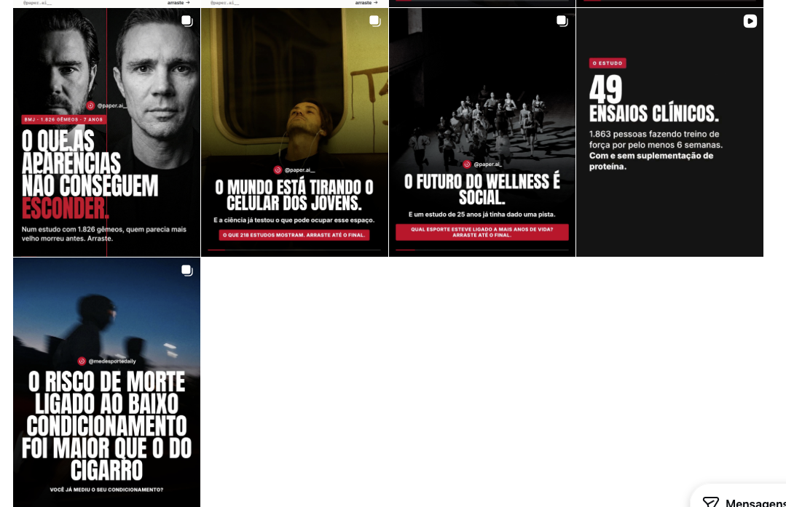

# Avaliação dos 5 posts de crescimento atuais

Análise dos cinco carrosséis do print ([`referencias/posts-atuais.png`](referencias/posts-atuais.png)). Avaliei capa, gancho, rigor do estudo e a grade como conjunto. Não vi os slides internos nem as legendas, então essa parte fica de fora. Cada estudo foi conferido no PubMed.

## O que já funciona (e a campanha nova mantém)

- **Foto de gente, com clima de cinema.** Rosto, corpo em movimento, luz baixa. É o que para o dedo no feed, e o post dos gêmeos é o melhor exemplo.
- **Selo com revista, *n* e tempo** ("BMJ · 1.826 gêmeos · 7 anos"). Dá autoridade em meio segundo, antes de qualquer frase.
- **Tipografia condensada em caixa alta, centralizada, com uma palavra em vermelho.** Lê bem no celular e virou a cara da página.
- **Chamada em tarja vermelha com uma pergunta** ("Qual esporte esteve ligado a mais anos de vida?"). É uma lacuna de curiosidade que obriga a arrastar.
- **Barra de progresso** embaixo. Mostra que tem mais e quanto falta.

## Post a post

### 1. "O que as aparências não conseguem esconder" (gêmeos)

**Estudo:** Christensen et al., BMJ 2009 · [doi:10.1136/bmj.b5262](https://doi.org/10.1136/bmj.b5262). 1.826 gêmeos dinamarqueses com 70 anos ou mais. A idade que as pessoas davam para eles, olhando a foto, previu a sobrevida mesmo descontando a idade real; quanto maior a diferença de aparência dentro do par, maior a chance de o gêmeo que parecia mais velho morrer primeiro.

- **Força:** o melhor gancho dos cinco. Dois rostos, uma promessa que qualquer pessoa entende, e o estudo cabe na capa.
- **Ajuste de rigor:** o subtítulo diz "quem parecia mais velho morreu antes". O estudo fala em *mais chance* de morrer primeiro, e em pessoas com 70 anos ou mais. Sugestão: "Em 1.826 gêmeos com mais de 70 anos, quem parecia mais velho tinha mais chance de morrer primeiro."
- **Ajuste visual:** o fio vermelho que divide as duas fotos atravessa a manchete. Pare o fio acima do texto.

### 2. "O mundo está tirando o celular dos jovens" (218 estudos)

**Estudo provável:** Noetel et al., BMJ 2024 · [doi:10.1136/bmj-2023-075847](https://doi.org/10.1136/bmj-2023-075847). 218 estudos, 14.170 participantes, exercício como tratamento de **depressão maior**.

- **Força:** tema quente (a Lei 15.100 e a discussão mundial), com promessa de solução.
- **Problema de rigor:** o estudo não é sobre jovens nem sobre celular. É sobre pessoas com diagnóstico de depressão, de qualquer idade. Ligar "tirar o celular" a "o que pode ocupar o espaço" é uma inferência nossa, e o próprio artigo classifica a confiança na evidência como baixa ou muito baixa. Se o post continuar, a ponte precisa ser dita com todas as letras: "o estudo não testou celular; testou exercício em quem tem depressão".
- **Problema de gancho:** "o mundo está tirando o celular" é uma constatação, não uma surpresa. O número que impressiona (218 estudos) ficou escondido na tarja.
- **Na campanha nova:** o carrossel 05 trata o mesmo tema com um estudo que mediu exatamente isso (SMART Schools, 1.227 alunos em 30 escolas).

### 3. "O futuro do wellness é social" (esporte e anos de vida)

**Estudo:** Schnohr et al., Mayo Clin Proc 2018 · [doi:10.1016/j.mayocp.2018.06.025](https://doi.org/10.1016/j.mayocp.2018.06.025). 8.577 pessoas de Copenhague, até 25 anos de acompanhamento. Ganho de expectativa de vida em relação a sedentários: tênis 9,7 anos, badminton 6,2, futebol 4,7, ciclismo 3,7, natação 3,4, corrida 3,2, calistenia 3,1, academia 1,5. Os autores notam que os esportes com mais interação social ficaram no topo, e pedem mais pesquisa.

- **Força:** a pergunta da tarja é ótima.
- **Problema de gancho:** a manchete é abstrata, e "wellness" soa como jargão de marca. A surpresa de verdade é que corrida e academia ficaram no fim da lista. Sugestão: "O esporte ligado a mais anos de vida ==não foi a corrida.==" A foto de corredores vira, aí, parte da virada.
- **Rigor:** o estudo é observacional; quem joga tênis pode ter mais renda e mais amigos por outros motivos. Isso precisa estar num slide.

### 4. "49 ensaios clínicos" (proteína)

**Estudo:** Morton et al., Br J Sports Med 2018 · [doi:10.1136/bjsports-2017-097608](https://doi.org/10.1136/bjsports-2017-097608). 49 ensaios, 1.863 pessoas, treino de força por pelo menos 6 semanas. A suplementação aumentou força (+2,49 kg no 1RM) e massa magra (+0,30 kg), com efeito menor com a idade, e **parou de somar acima de cerca de 1,6 g/kg/dia** de proteína total.

- **Problema:** a capa é um slide do meio da história. Número de estudos não gera curiosidade; é credencial, e credencial vai no selo. Também é o único post sem foto, e quebra a grade.
- **Sugestão:** "O whey ==tem teto.==" com selo "BJSM · 49 ensaios · 1.863 pessoas" e a resposta (1,6 g/kg/dia) no slide 5.

### 5. "O risco de morte ligado ao baixo condicionamento foi maior que o do cigarro"

**Estudo:** Mandsager et al., JAMA Netw Open 2018 · [doi:10.1001/jamanetworkopen.2018.3605](https://doi.org/10.1001/jamanetworkopen.2018.3605). 122.007 pacientes encaminhados para teste de esteira na Cleveland Clinic. Comparando o grupo de pior condicionamento com a elite, o risco de morte foi 5,04 vezes maior; o do tabagismo, 1,41.

- **Força:** comparar com um vilão conhecido (o cigarro) é um dos ganchos mais fortes que existem.
- **Rigor:** o dado é verdadeiro, mas a comparação é entre extremos (pior contra elite) e a população é de pacientes que já iam fazer teste de esteira num hospital, não a população geral. Isso precisa aparecer nos slides internos.
- **Marca:** a assinatura é **@medesportedaily**, não @paper.ai__. Se foi repostado de outra página, precisa de crédito; se é da casa, a assinatura tem de ser a mesma dos outros.
- **Visual:** seis linhas de manchete, todas brancas, sem palavra em destaque e sem selo. Sugestão: "Baixo condicionamento ==pesou mais que o cigarro.==" com selo "JAMA Netw Open · 122.007 pacientes".

## A grade como conjunto

- **Tudo escuro.** Os cinco são pretos ou quase pretos, com o mesmo layout. Um por um ficam bonitos; juntos, o perfil vira um bloco só e cada post novo parece repetido. A campanha nova resolve com três paletas (escuro, vibrante e claro) em rodízio, uma por coluna.
- **Pauta de academia demais.** Quatro dos cinco são sobre exercício, e o quinto sobre envelhecimento. A campanha nova abre para temas que o Brasil inteiro está discutindo: canetas, bets, celular na escola, IA no consultório, álcool, ultraprocessados.
- **Pouco Brasil.** Nenhum dos cinco puxa um fato brasileiro. Na campanha nova, 9 dos 20 partem de um fato brasileiro, e três estudos têm autores brasileiros (sentar e levantar, do Rio; temperatura, com a FMUSP; força da mão, com o Instituto Dante Pazzanese).

## O que mudou na campanha nova por causa desta avaliação

| Achado aqui | O que a campanha faz |
|---|---|
| Ponte entre gancho e estudo às vezes era inferência | Estudo escolhido para responder exatamente à pergunta do gancho; interpretação nossa sempre rotulada |
| Limite do estudo não aparecia na capa nem na grade | Ficha com "O que não dá para dizer" em todos os 20 |
| Capa com credencial em vez de gancho | Credencial vai no selo; a manchete é sempre uma afirmação ou uma cena |
| Grade toda escura | Três paletas em rodízio, escolhidas pelo tom do tema |
| Assinatura diferente em um post | Assinatura única, @paper.ai__, gerada automaticamente |
| CTA genérico | CTA de envio com destinatário ("manda pro seu pai fazer o teste") |
