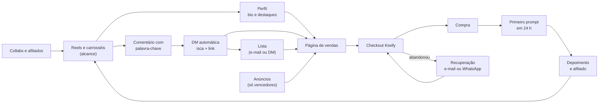

# Engenharia de marketing

Parte do [plano de alcance](plano-de-alcance.md). O sistema que transforma alcance em venda: por onde a pessoa entra, como ela é capturada se não comprar na hora, como cada etapa é medida e quanto dá para pagar por uma venda.

## 1. O funil



| Etapa | Pergunta que a etapa responde | Onde medir |
|---|---|---|
| Alcance | O conteúdo chega em quem não segue? | Insights: visualizações, % de não seguidores, envios |
| Perfil | Quem chegou entende o que é e segue? | Insights: visitas ao perfil → seguidores; toques no link |
| Captura | Quem não vai comprar agora deixa contato? | ManyChat: comentários, DMs enviadas, e-mails coletados |
| Página | A página convence a ir para o checkout? | Pixel/Analytics: visitas; Kiwify: acessos ao checkout |
| Checkout | Quem chega ao checkout paga? | Kiwify: checkouts iniciados × vendas, por UTM |
| Pós-compra | Quem comprou usa, gosta e indica? | Respostas ao e-mail do dia 3, depoimentos, vendas de afiliados, reembolsos |

## 2. Perfil e links

**Nome** (campo pesquisável, até 30 caracteres; o @ já diz paper.ai__): `Prompts para pesquisa médica`

**Bio:**
```
Prompts de IA para pesquisa científica
Buscar · ler · checar · usar evidência
Feito por médico residente (USP · HC-FMUSP)
↓ 11 prompts por R$ 39,90
```

**Link da bio:** a página, com a origem marcada:
`https://bibliotecapaperai.netlify.app/?utm_source=instagram&utm_medium=bio`

**Arquitetura de links (um destino por intenção):**

| De onde | Para onde | UTM |
|---|---|---|
| Bio | Página | `utm_medium=bio` |
| Destaques | Página (seção certa) | `utm_medium=stories&utm_content=<destaque>` (já nos Stories) |
| Stories do dia | Página | `utm_medium=stories&utm_content=<data>` |
| DM automática | Página | `utm_medium=dm&utm_content=<palavra>` |
| Destaque Acesso | Checkout direto | `utm_medium=stories&utm_content=acesso` |
| Anúncios | Página | `utm_source=meta&utm_medium=ads&utm_content=<criativo>` |
| Afiliados | Link de afiliado da Kiwify | automático |

A página repassa `utm_*` e `src` ao checkout, e a Kiwify mostra as vendas por origem.

## 3. Comentário → DM (ManyChat ou similar)

A ManyChat é parceira oficial da Meta e tem plano grátis com automação de comentário para DM ([tendências](../pesquisa/tendencias-instagram-2026.md), [INDICATIVO]). Três palavras-chave:

**BIBLIOTECA** (fim dos Reels de demonstração e dos carrosséis de produto)
> Oi, {nome}! Aqui está a Biblioteca de Prompts paper.ai__: 11 prompts para buscar, ler, checar e usar evidência com IA, no Claude, no ChatGPT ou no Gemini.
> [Botão: Ver a Biblioteca] → página com `utm_medium=dm&utm_content=biblioteca`
> Quer também o contrato de veracidade, grátis? É a regra que faz a IA mostrar a fonte.
> [Botão: Quero]

**ESTUDO** (fim dos Reels "estudo por trás da manchete")
> Oi, {nome}! Esse estudo eu li com o P1, o prompt que faz a IA buscar no PubMed os melhores artigos do tema, com nível de evidência e link. Quer o contrato de veracidade grátis para testar na sua IA?
> [Botão: Quero] → pede o e-mail → entrega a isca

**TCC** (conteúdo de busca e referências)
> Oi, {nome}! Para o TCC, os dois prompts que mais ajudam são o P2 (monta a busca do PubMed com os termos MeSH e o texto de métodos) e o P8 (confere se cada referência existe).
> [Botão: Ver os 11 prompts] → página `#prompts`

**Regras:** uma palavra por post, em maiúsculas, dita no vídeo e escrita na legenda. Responda também o comentário em público ("te mandei na DM"), porque resposta conta como interação. Na coleta de e-mail, diga para que ele serve e como sair da lista (LGPD).

## 4. Isca e sequência

**Isca:** *"O contrato de veracidade (versão curta) + checklist: conferir uma referência em 60 segundos"*, em PDF de 2 páginas. A identidade permite versões curtas gratuitas, e o contrato já aparece no carrossel 02; o prompt completo continua sendo o que se vende.

**Sequência de 5 mensagens em 7 dias** (e-mail ou DM):

| Dia | Assunto | Conteúdo |
|---|---|---|
| 0 | Seu contrato de veracidade | Entrega da isca + como colar antes de qualquer pedido de artigo |
| 1 | Por que a IA inventa referência | O estudo de 2023 (55% no GPT-3.5, 18% no GPT-4, com o limite) e o que muda quando a IA precisa abrir o artigo |
| 3 | Uma resposta de verdade | O exemplo sobre vitamina D, com os links do PubMed, e o vídeo de 28 s |
| 5 | As 4 dúvidas que mais chegam | IA gratuita, celular, inglês, garantia |
| 7 | Os 11 prompts por R$ 39,90 | Oferta, garantia de 7 dias e, só se for verdade, o prazo da condição |

## 5. Kiwify

| Recurso | Para que usar | Situação |
|---|---|---|
| **Pixel da Meta** | Registrar compra e montar público de quem visitou e não comprou | Configurar no produto e colar o mesmo pixel na página |
| **Recuperação de carrinho** | Lembrete por e-mail para quem abandonou; a Kiwify também oferece agente de recuperação por WhatsApp ([EngagED](https://engaged.com.br/blog/kiwify-ou-kirvano-qual-escolher/)) | Ligar e escrever a mensagem no tom da marca |
| **Afiliados** | Estudantes e residentes que gostaram vendem por comissão | Abrir na semana 5, com regras e kit |
| **Order bump** | Um produto pequeno oferecido no checkout ([Kiwify](https://ajuda.kiwify.com.br/pt-br/article/como-funcionam-os-order-bumps-1bb22bl/)) | Só quando houver um segundo produto real (ideia: guia de leitura crítica em 1 página) |
| **Webhooks e integrações** | Mandar compras e carrinhos para planilha, e-mail ou WhatsApp | Opcional, via Zapier ou integração nativa |

**Pós-compra (e-mail ou área de membros):**
- **Dia 0:** acesso + "rode o P1 hoje com um tema seu; leva 3 minutos".
- **Dia 3:** "Qual prompt você usou? Me responda com uma frase." (feedback e matéria-prima de conteúdo)
- **Dia 7:** pedido de depoimento com autorização por escrito + convite para ser afiliado.

**Kit do afiliado:** os Stories e Reels de demonstração, 3 legendas prontas, as regras (sem promessa de resultado, sem depoimento inventado, sem spam em grupo) e o link.

## 6. Anúncios

### A conta que decide tudo

| Item | Valor |
|---|---|
| Preço | R$ 39,90 |
| Taxa da Kiwify | cerca de 8,99% + R$ 2,49 = R$ 6,08 ([INDICATIVO], confira no painel) |
| **Líquido por venda** | **cerca de R$ 33,82** (antes de impostos) |
| **Custo máximo por venda (equilíbrio)** | **cerca de R$ 33** |

Quanto dá para pagar por clique, com as suas taxas reais:

> **CPC máximo = líquido × (página → checkout) × (checkout → compra)**
>
> Exemplo, com taxas hipotéticas: se 15% dos visitantes vão ao checkout e 30% deles compram, a página converte 4,5%. O CPC de equilíbrio é R$ 33,82 × 0,045 ≈ **R$ 1,52**. Troque pelas suas taxas depois de 2 semanas.

Com produto de R$ 39,90 e sem segundo produto, o anúncio precisa pagar a si mesmo na primeira venda. Por isso: **orgânico primeiro, anúncio só em cima do que já venceu.**

### Estrutura (a partir da semana 5)

1. **Campanha de Vendas** com o pixel registrando a compra.
2. **Conjunto aberto:** Brasil, 18 a 45 anos, público amplo, para o sistema achar quem compra.
3. **Conjunto de remarketing:** quem interagiu com o perfil em 30 dias + quem visitou a página em 14 dias, excluindo compradores.
4. **3 criativos:** os Reels orgânicos vencedores ([criativos, seção 8](reels-e-criativos.md)), usando o próprio post.
5. **Orçamento de teste:** R$ 30 por dia por 7 dias (cerca de R$ 210).

**Regras de decisão:**
- Criativo que gastou cerca de R$ 50 (1,5 venda de equilíbrio) sem nenhuma venda: pausar.
- Criativo com custo por venda abaixo de R$ 25: aumentar 20% a cada 3 dias enquanto se mantiver.
- Remarketing costuma vender mais barato; se ele não vender, o problema está na página ou na oferta, não no anúncio.

**Alternativa simples:** impulsionar um Reel vencedor com o objetivo de visitas ao perfil, por R$ 10 a R$ 20 por dia, só para ganhar seguidores do público certo. Não mede venda, mas ensina quem responde.

## 7. Painel semanal (20 minutos toda segunda)

| Métrica | Fórmula ou onde | Leitura |
|---|---|---|
| Visualizações e alcance | Insights | Tendência, não o número do dia |
| % de não seguidores | Insights → alcance | Subindo = o conteúdo está sendo recomendado |
| **Envios por alcance** | envios ÷ alcance, por post | O melhor indicador de alcance futuro |
| **Salvamentos por alcance** | salvamentos ÷ alcance | Indicador de valor para o público comprador |
| Tempo médio assistido (Reels) | Insights do Reel | Compare com a sua mediana |
| Seguidores por visita ao perfil | seguidores ganhos ÷ visitas ao perfil | Baixo = bio ou grade não convencem |
| Toques no link | Insights | Interesse de compra |
| DMs e e-mails capturados | ManyChat | Saúde da captura |
| Página → checkout | acessos ao checkout ÷ visitas à página | Baixo = a página não convence |
| Checkout → compra | vendas ÷ checkouts | Baixo = preço, confiança ou meio de pagamento |
| Vendas por origem | Kiwify, por UTM | Onde investir tempo |
| Custo por venda | gasto ÷ vendas (anúncios) | Contra o equilíbrio de cerca de R$ 33 |

**Decisões da semana (sempre as mesmas 3):**
1. Qual post teve mais envios por alcance? → ganha nova versão.
2. Qual etapa do funil caiu? → uma mudança nela, só uma, para saber o que funcionou.
3. Que pergunta mais apareceu nos comentários e DMs? → vira Reel "Pergunta do comentário".

## 8. Colaborações

| Com quem | Formato | O que oferecer |
|---|---|---|
| Ligas acadêmicas | Post em conjunto: "5 prompts para journal club" | Acesso para a diretoria e comissão de afiliado |
| Residentes que produzem conteúdo | Reel em conjunto ou live | Acesso + afiliado |
| Professores de medicina baseada em evidências | Live "Leitura crítica ao vivo" | Visibilidade para o curso ou o livro deles |
| Perfis de estudo e residência | Carrossel convidado | Conteúdo pronto no formato deles |

**Mensagem de abordagem:**
> Oi, {nome}! Sou médico residente e faço a paper.ai__, prompts de IA para pesquisa científica com checagem de fonte. Curto muito o seu conteúdo sobre {tema}. Topa fazermos um post em conjunto sobre {ideia}? Eu preparo a arte no seu estilo e libero o acesso à Biblioteca para você testar antes.

## 9. Ferramentas

| Para quê | Ferramenta | Observação |
|---|---|---|
| Venda, checkout, afiliados, recuperação | Kiwify | Já em uso |
| Página | Netlify (ou outro host estático) | Ligada ao GitHub, atualiza sozinha |
| Comentário → DM, coleta de e-mail | ManyChat ou similar | Plano grátis para começar |
| E-mail | Brevo, MailerLite ou similar | Plano grátis para começar |
| Anúncios e pixel | Gerenciador de Anúncios da Meta | |
| Edição de Reels | Edits (do Instagram) ou CapCut | Legenda automática, sempre revisada |
| Agendamento e relatórios | Meta Business Suite (grátis) | Agenda Reels, carrosséis e Stories |
| Conteúdo | Este repositório (`npm run render`, `reels`, `stories`) | Os geradores já seguem a identidade |

## 10. Implantação, em ordem

- [ ] Bio, nome e link com UTM (15 min)
- [ ] Destaques no ar com as capas (30 min)
- [ ] Página na Netlify com o nome `bibliotecapaperai` (10 min)
- [ ] Pixel da Meta criado; ID colado na Kiwify e na página (o Claude cola na página se você mandar o ID)
- [ ] ManyChat com BIBLIOTECA, ESTUDO e TCC (40 min)
- [ ] Isca em PDF (o Claude monta)
- [ ] Sequência de 5 mensagens na ferramenta de e-mail (o Claude escreve os textos completos)
- [ ] Recuperação de carrinho ligada na Kiwify
- [ ] 10 a 15 primeiros leitores convidados
- [ ] Planilha do painel semanal (o Claude monta)
