# Carrosséis prontos

Gerado por `npm run render`. Formato 3:4 (1080×1440).

Cada pasta tem os slides numerados (`01.png`, `02.png`…), a legenda pronta para colar (`legenda.txt`) e o texto alternativo de cada slide (`alt-text.txt`).

| # | Carrossel | Prompt da biblioteca | Arquétipo | Objetivo | Quando postar |
|---|---|---|---|---|---|
| 01 | [Manifesto da paper.ai__](#01-manifesto) | — | Bastidor / venda | seguidores (fixar no perfil) | Semana 1 · segunda |
| 02 | [O contrato de veracidade](#02-contrato-de-veracidade) | — | O que é…? | salvamentos | Semana 1 · quarta |
| 03 | [P1 · Motor de Busca de Referências](#03-p1-motor-de-busca) | P1 · Motor de Busca de Referências | Prompt da biblioteca | salvamentos | Semana 1 · sexta |
| 04 | [P2 · Gerador de Busca Avançada](#04-p2-busca-pubmed) | P2 · Gerador de Busca Avançada | Prompt da biblioteca | salvamentos | Semana 2 · segunda |
| 05 | [P8 · Detector de Referência Falsa](#05-p8-referencia-falsa) | P8 · Detector de Referência Falsa | Erro / alerta | envios | Semana 2 · quarta |
| 06 | [P4 · Triagem Rápida (e o P5)](#06-p4-triagem-rapida) | P4 · Triagem Rápida | Prompt da biblioteca | salvamentos | Semana 2 · sexta |
| 07 | [P10 · Tradutor Clínico](#07-p10-tradutor-clinico) | P10 · Tradutor Clínico | O que é…? | salvamentos | Semana 3 · segunda |
| 08 | [P9 · Diretriz vs. Estudo Novo](#08-p9-diretriz-vs-estudo-novo) | P9 · Diretriz vs. Estudo Novo | Erro / alerta | envios | Semana 3 · quarta |
| 09 | [P7 · Caçador de Vieses](#09-p7-cacador-de-vieses) | P7 · Caçador de Vieses | O que é…? | salvamentos | Semana 3 · sexta |
| 10 | [5 regras de IA para médicos](#10-cinco-regras-ia-etica) | — | Erro / alerta | envios | Semana 4 · segunda |
| 11 | [Pedido comum × pedido da biblioteca](#11-pedido-comum-x-biblioteca) | — | Contraste | envios | Semana 4 · quarta |
| 12 | [Onze prompts, um para cada momento](#12-onze-prompts) | — | Fluxo / venda | comentários (lista de espera) | Semana 4 · sexta |

## Manifesto da paper.ai__

**Bastidor / venda** · objetivo: seguidores (fixar no perfil) · Semana 1 · segunda · 8 slides · [slides](01-manifesto/) · [legenda](01-manifesto/legenda.txt) · [alt text](01-manifesto/alt-text.txt)

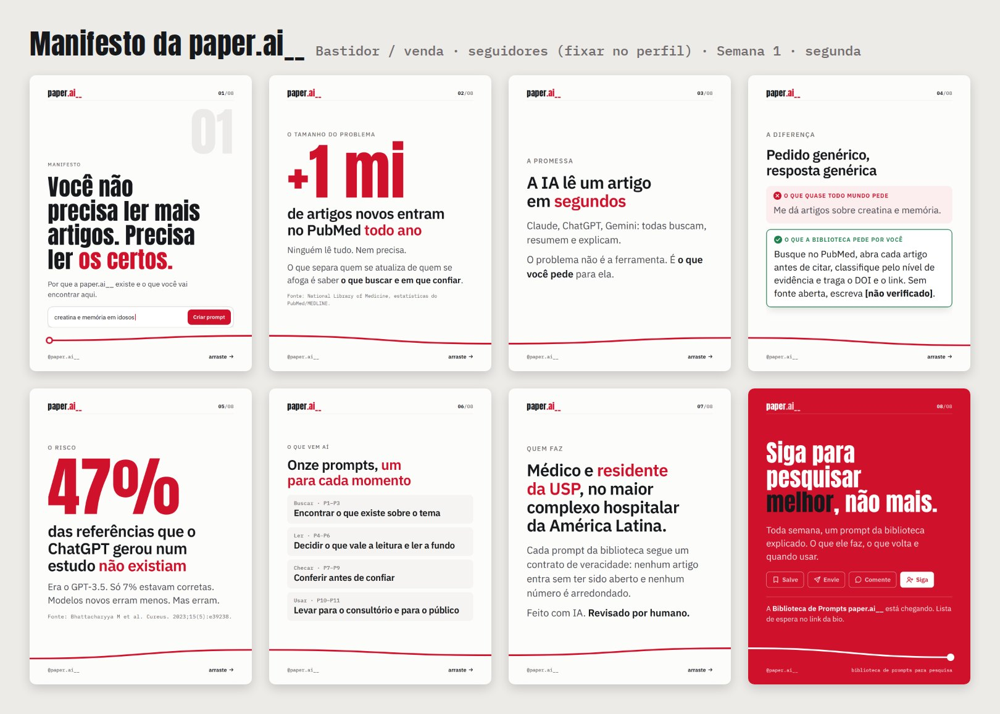

## O contrato de veracidade

**O que é…?** · objetivo: salvamentos · Semana 1 · quarta · 7 slides · [slides](02-contrato-de-veracidade/) · [legenda](02-contrato-de-veracidade/legenda.txt) · [alt text](02-contrato-de-veracidade/alt-text.txt)

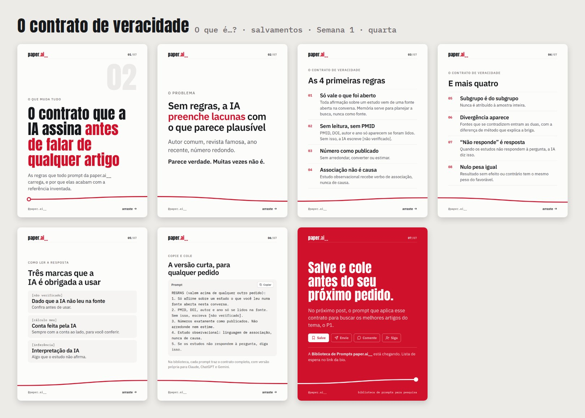

## P1 · Motor de Busca de Referências

**P1 · Motor de Busca de Referências** · **Prompt da biblioteca** · objetivo: salvamentos · Semana 1 · sexta · 8 slides · [slides](03-p1-motor-de-busca/) · [legenda](03-p1-motor-de-busca/legenda.txt) · [alt text](03-p1-motor-de-busca/alt-text.txt)

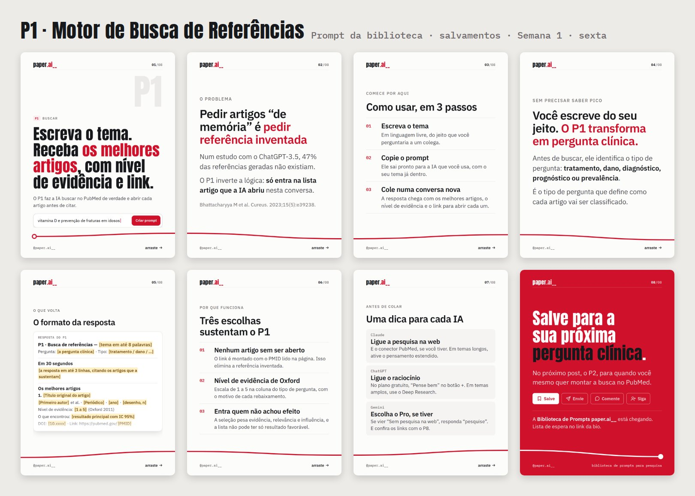

## P2 · Gerador de Busca Avançada

**P2 · Gerador de Busca Avançada** · **Prompt da biblioteca** · objetivo: salvamentos · Semana 2 · segunda · 7 slides · [slides](04-p2-busca-pubmed/) · [legenda](04-p2-busca-pubmed/legenda.txt) · [alt text](04-p2-busca-pubmed/alt-text.txt)

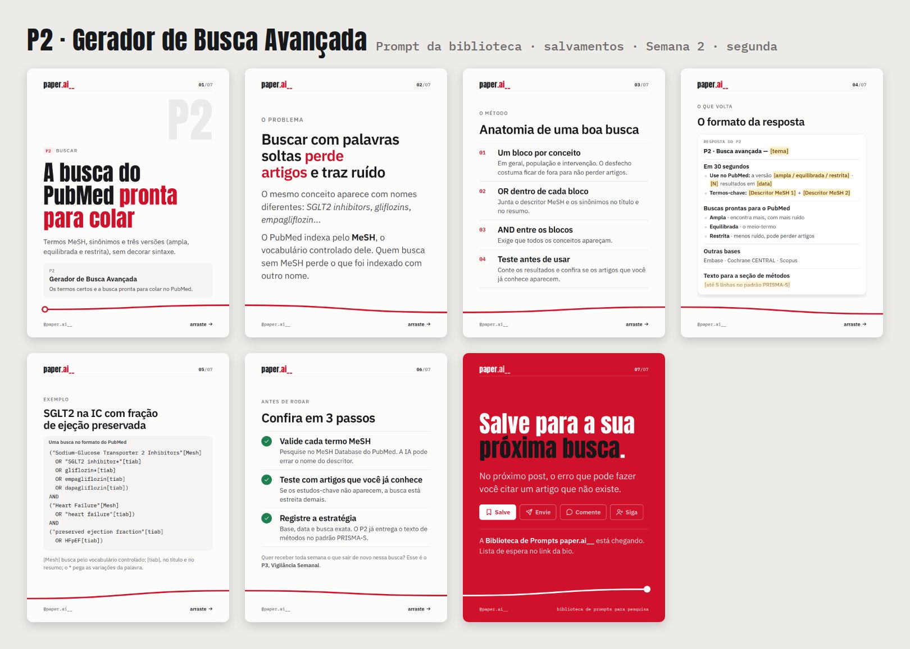

## P8 · Detector de Referência Falsa

**P8 · Detector de Referência Falsa** · **Erro / alerta** · objetivo: envios · Semana 2 · quarta · 7 slides · [slides](05-p8-referencia-falsa/) · [legenda](05-p8-referencia-falsa/legenda.txt) · [alt text](05-p8-referencia-falsa/alt-text.txt)

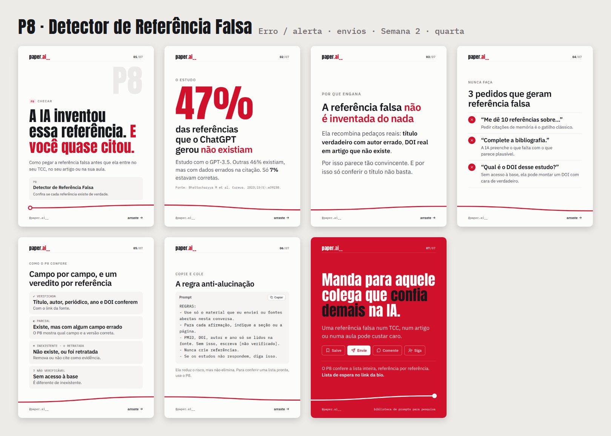

## P4 · Triagem Rápida (e o P5)

**P4 · Triagem Rápida** · **Prompt da biblioteca** · objetivo: salvamentos · Semana 2 · sexta · 7 slides · [slides](06-p4-triagem-rapida/) · [legenda](06-p4-triagem-rapida/legenda.txt) · [alt text](06-p4-triagem-rapida/alt-text.txt)

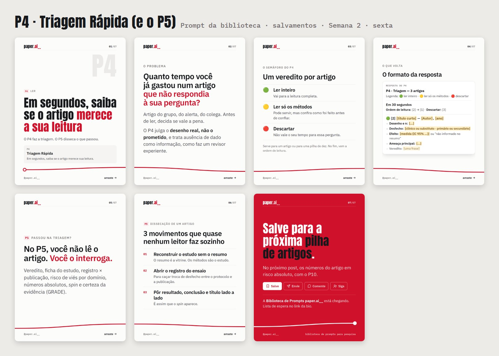

## P10 · Tradutor Clínico

**P10 · Tradutor Clínico** · **O que é…?** · objetivo: salvamentos · Semana 3 · segunda · 7 slides · [slides](07-p10-tradutor-clinico/) · [legenda](07-p10-tradutor-clinico/legenda.txt) · [alt text](07-p10-tradutor-clinico/alt-text.txt)

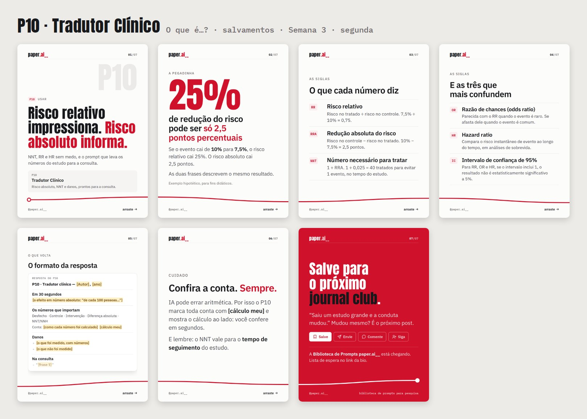

## P9 · Diretriz vs. Estudo Novo

**P9 · Diretriz vs. Estudo Novo** · **Erro / alerta** · objetivo: envios · Semana 3 · quarta · 7 slides · [slides](08-p9-diretriz-vs-estudo-novo/) · [legenda](08-p9-diretriz-vs-estudo-novo/legenda.txt) · [alt text](08-p9-diretriz-vs-estudo-novo/alt-text.txt)

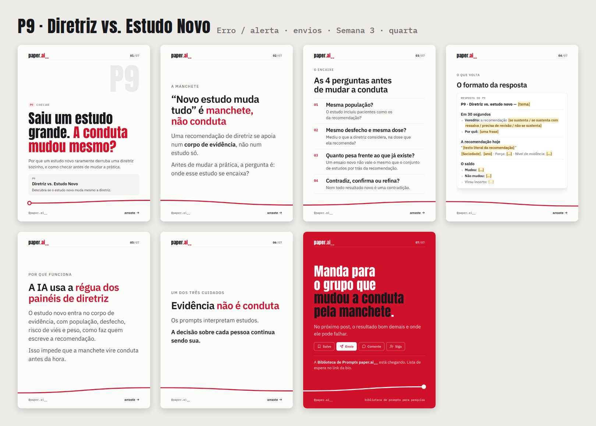

## P7 · Caçador de Vieses

**P7 · Caçador de Vieses** · **O que é…?** · objetivo: salvamentos · Semana 3 · sexta · 7 slides · [slides](09-p7-cacador-de-vieses/) · [legenda](09-p7-cacador-de-vieses/legenda.txt) · [alt text](09-p7-cacador-de-vieses/alt-text.txt)

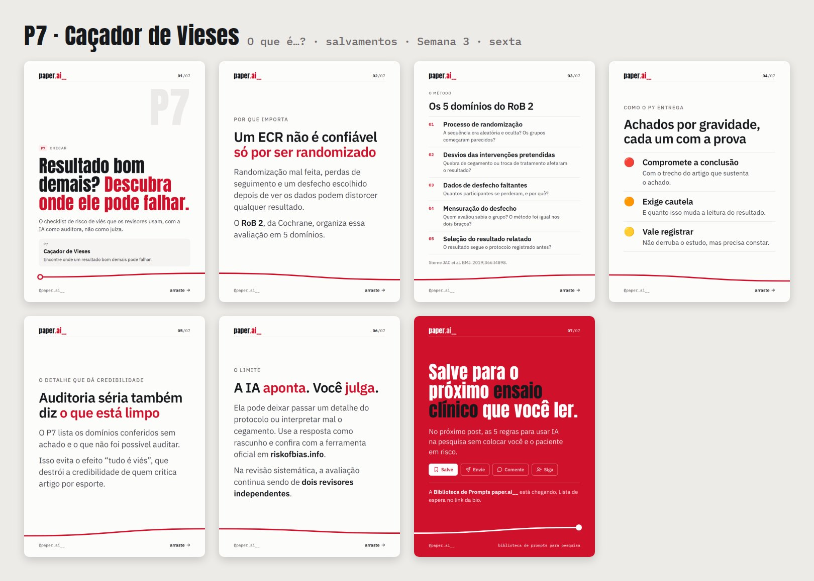

## 5 regras de IA para médicos

**Erro / alerta** · objetivo: envios · Semana 4 · segunda · 8 slides · [slides](10-cinco-regras-ia-etica/) · [legenda](10-cinco-regras-ia-etica/legenda.txt) · [alt text](10-cinco-regras-ia-etica/alt-text.txt)

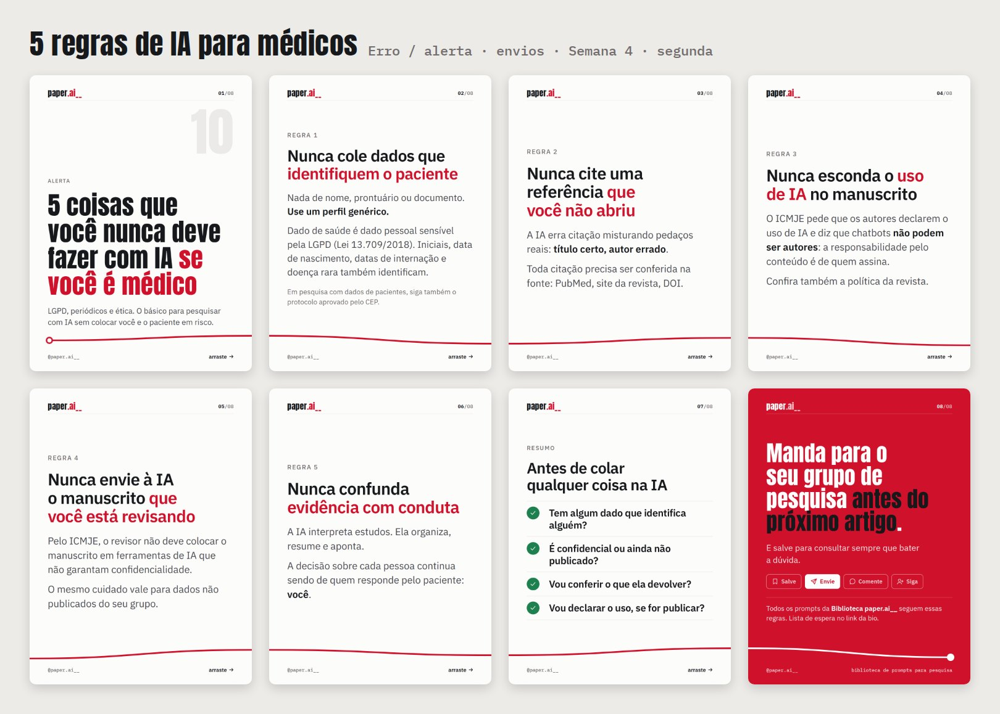

## Pedido comum × pedido da biblioteca

**Contraste** · objetivo: envios · Semana 4 · quarta · 7 slides · [slides](11-pedido-comum-x-biblioteca/) · [legenda](11-pedido-comum-x-biblioteca/legenda.txt) · [alt text](11-pedido-comum-x-biblioteca/alt-text.txt)

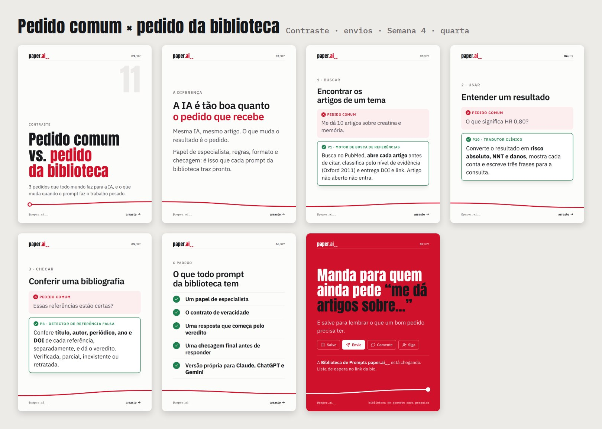

## Onze prompts, um para cada momento

**Fluxo / venda** · objetivo: comentários (lista de espera) · Semana 4 · sexta · 8 slides · [slides](12-onze-prompts/) · [legenda](12-onze-prompts/legenda.txt) · [alt text](12-onze-prompts/alt-text.txt)

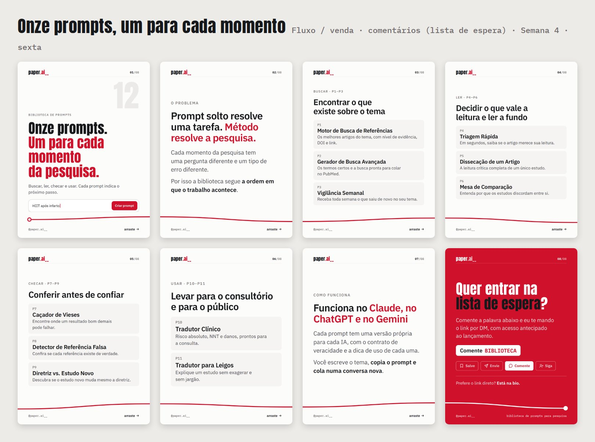
