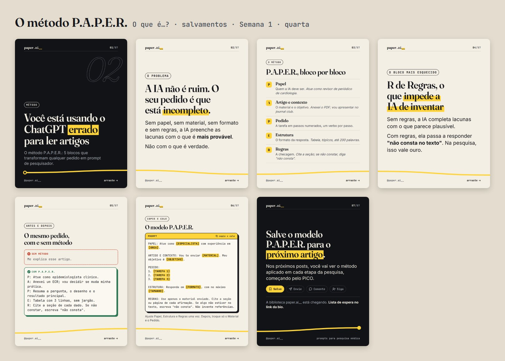
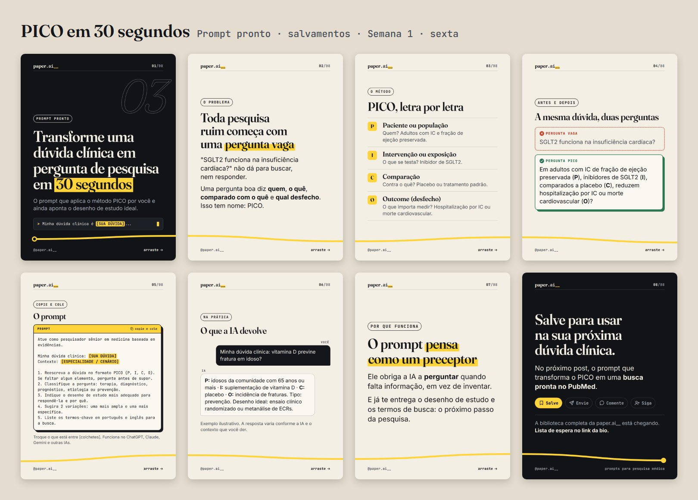
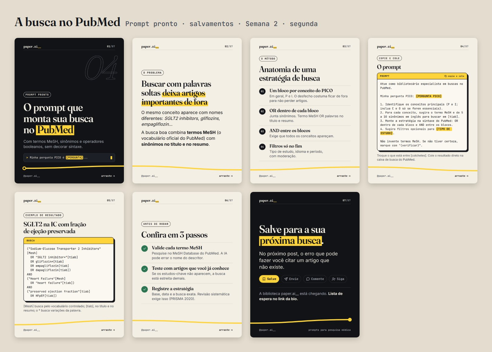
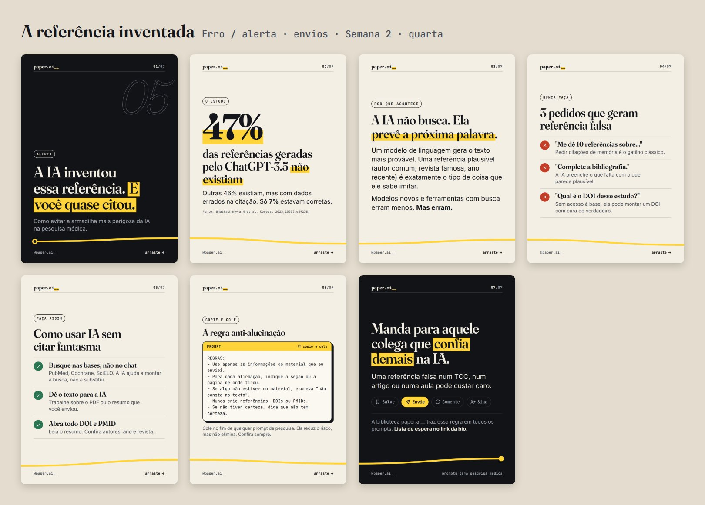
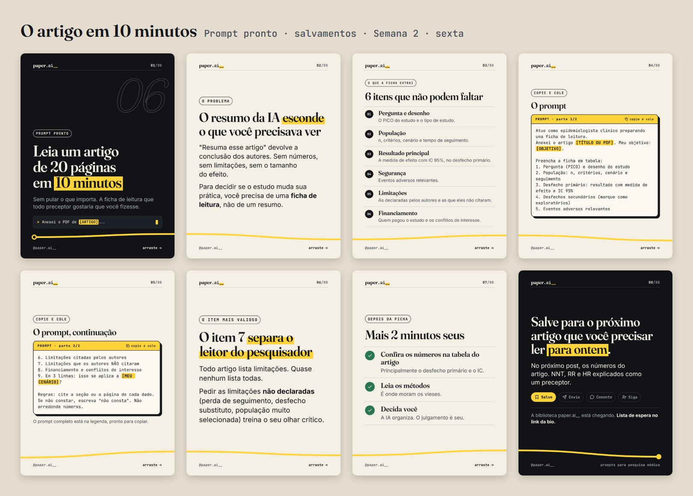
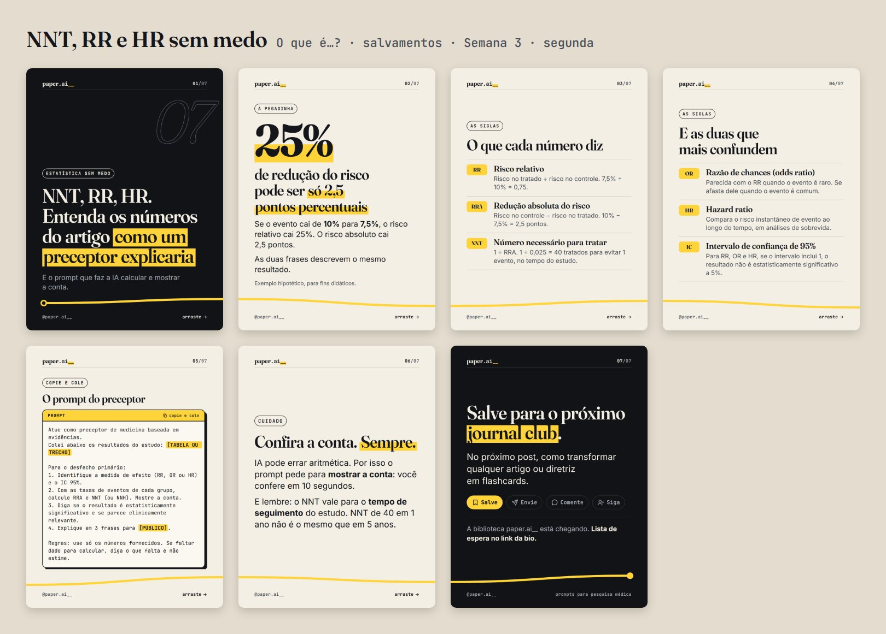
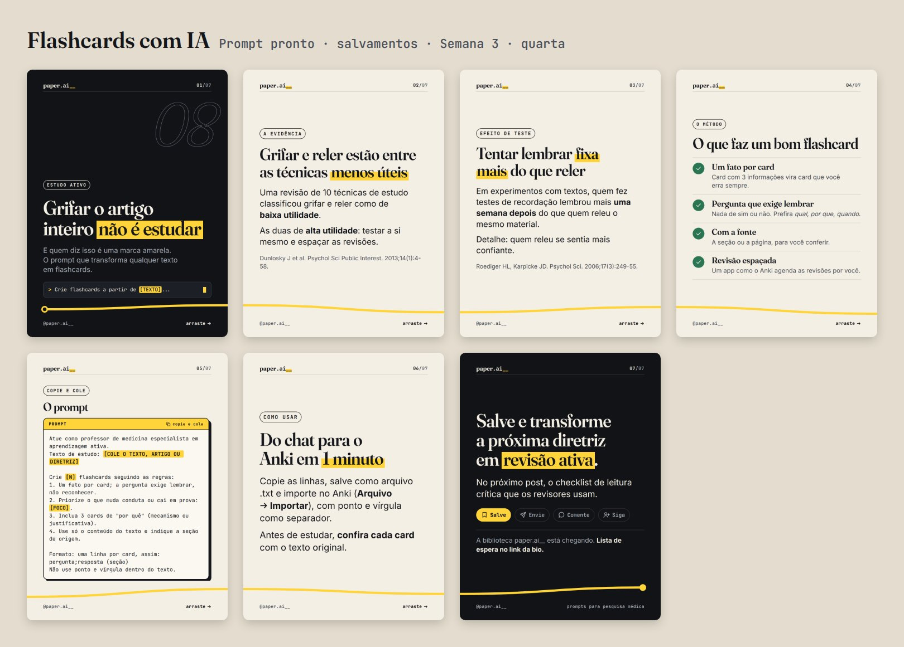
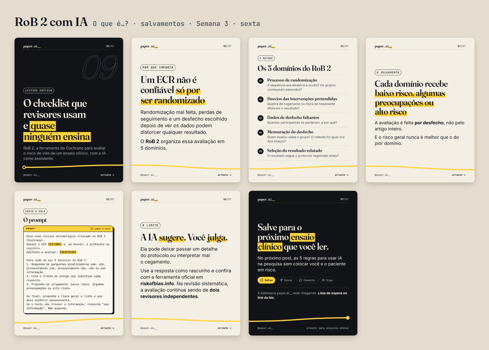
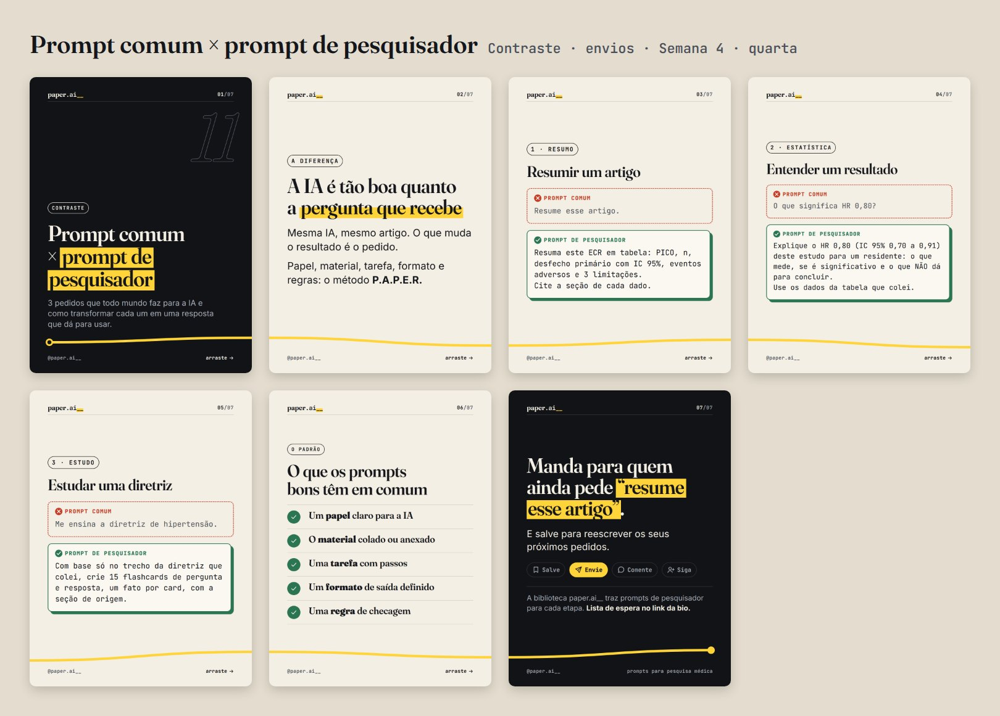
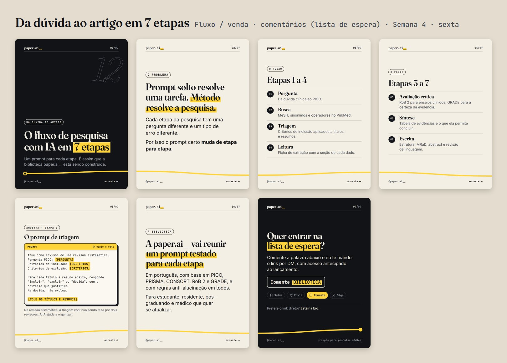

# Carrosséis prontos

Gerado por `npm run render`. Formato 3:4 (1080×1440).

Cada pasta tem os slides numerados (`01.png`, `02.png`…), a legenda pronta para colar (`legenda.txt`) e o texto alternativo de cada slide (`alt-text.txt`).

| # | Carrossel | Arquétipo | Objetivo | Quando postar |
|---|---|---|---|---|
| 01 | [Manifesto da paper.ai__](#01-manifesto) | Bastidor / venda | seguidores (fixar no perfil) | Semana 1 · segunda |
| 02 | [O método P.A.P.E.R.](#02-metodo-paper) | O que é…? | salvamentos | Semana 1 · quarta |
| 03 | [PICO em 30 segundos](#03-pico-em-30-segundos) | Prompt pronto | salvamentos | Semana 1 · sexta |
| 04 | [A busca no PubMed](#04-busca-pubmed) | Prompt pronto | salvamentos | Semana 2 · segunda |
| 05 | [A referência inventada](#05-referencia-inventada) | Erro / alerta | envios | Semana 2 · quarta |
| 06 | [O artigo em 10 minutos](#06-artigo-em-10-minutos) | Prompt pronto | salvamentos | Semana 2 · sexta |
| 07 | [NNT, RR e HR sem medo](#07-nnt-rr-hr) | O que é…? | salvamentos | Semana 3 · segunda |
| 08 | [Flashcards com IA](#08-flashcards) | Prompt pronto | salvamentos | Semana 3 · quarta |
| 09 | [RoB 2 com IA](#09-rob2-leitura-critica) | O que é…? | salvamentos | Semana 3 · sexta |
| 10 | [5 regras de IA para médicos](#10-cinco-regras-ia-etica) | Erro / alerta | envios | Semana 4 · segunda |
| 11 | [Prompt comum × prompt de pesquisador](#11-prompt-comum-x-pesquisador) | Contraste | envios | Semana 4 · quarta |
| 12 | [Da dúvida ao artigo em 7 etapas](#12-fluxo-7-etapas) | Fluxo / venda | comentários (lista de espera) | Semana 4 · sexta |

## Manifesto da paper.ai__

**Bastidor / venda** · objetivo: seguidores (fixar no perfil) · Semana 1 · segunda · 8 slides · [slides](01-manifesto/) · [legenda](01-manifesto/legenda.txt) · [alt text](01-manifesto/alt-text.txt)

## O método P.A.P.E.R.

**O que é…?** · objetivo: salvamentos · Semana 1 · quarta · 7 slides · [slides](02-metodo-paper/) · [legenda](02-metodo-paper/legenda.txt) · [alt text](02-metodo-paper/alt-text.txt)

## PICO em 30 segundos

**Prompt pronto** · objetivo: salvamentos · Semana 1 · sexta · 8 slides · [slides](03-pico-em-30-segundos/) · [legenda](03-pico-em-30-segundos/legenda.txt) · [alt text](03-pico-em-30-segundos/alt-text.txt)

## A busca no PubMed

**Prompt pronto** · objetivo: salvamentos · Semana 2 · segunda · 7 slides · [slides](04-busca-pubmed/) · [legenda](04-busca-pubmed/legenda.txt) · [alt text](04-busca-pubmed/alt-text.txt)

## A referência inventada

**Erro / alerta** · objetivo: envios · Semana 2 · quarta · 7 slides · [slides](05-referencia-inventada/) · [legenda](05-referencia-inventada/legenda.txt) · [alt text](05-referencia-inventada/alt-text.txt)

## O artigo em 10 minutos

**Prompt pronto** · objetivo: salvamentos · Semana 2 · sexta · 8 slides · [slides](06-artigo-em-10-minutos/) · [legenda](06-artigo-em-10-minutos/legenda.txt) · [alt text](06-artigo-em-10-minutos/alt-text.txt)

## NNT, RR e HR sem medo

**O que é…?** · objetivo: salvamentos · Semana 3 · segunda · 7 slides · [slides](07-nnt-rr-hr/) · [legenda](07-nnt-rr-hr/legenda.txt) · [alt text](07-nnt-rr-hr/alt-text.txt)

## Flashcards com IA

**Prompt pronto** · objetivo: salvamentos · Semana 3 · quarta · 7 slides · [slides](08-flashcards/) · [legenda](08-flashcards/legenda.txt) · [alt text](08-flashcards/alt-text.txt)

## RoB 2 com IA

**O que é…?** · objetivo: salvamentos · Semana 3 · sexta · 7 slides · [slides](09-rob2-leitura-critica/) · [legenda](09-rob2-leitura-critica/legenda.txt) · [alt text](09-rob2-leitura-critica/alt-text.txt)

## 5 regras de IA para médicos

**Erro / alerta** · objetivo: envios · Semana 4 · segunda · 8 slides · [slides](10-cinco-regras-ia-etica/) · [legenda](10-cinco-regras-ia-etica/legenda.txt) · [alt text](10-cinco-regras-ia-etica/alt-text.txt)

## Prompt comum × prompt de pesquisador

**Contraste** · objetivo: envios · Semana 4 · quarta · 7 slides · [slides](11-prompt-comum-x-pesquisador/) · [legenda](11-prompt-comum-x-pesquisador/legenda.txt) · [alt text](11-prompt-comum-x-pesquisador/alt-text.txt)

## Da dúvida ao artigo em 7 etapas

**Fluxo / venda** · objetivo: comentários (lista de espera) · Semana 4 · sexta · 7 slides · [slides](12-fluxo-7-etapas/) · [legenda](12-fluxo-7-etapas/legenda.txt) · [alt text](12-fluxo-7-etapas/alt-text.txt)

