# Campanha de crescimento

Gerado por `npm run render`. Formato 3:4 (1080×1440).

Cada pasta tem os slides numerados (`01.jpg`, `02.jpg`…), a legenda pronta para colar (`legenda.txt`) e o texto alternativo de cada slide (`alt-text.txt`).

Fotos: veja a lista do que buscar em [`campanha/fotos/LISTA.md`](../../campanha/fotos/LISTA.md). Enquanto a foto não é adicionada, a capa sai com um fundo provisório marcado como "foto pendente".

| # | Carrossel | Pauta | Estudo | Paleta | Quando postar |
|---|---|---|---|---|---|
| 01 | [O que acontece quando você para a caneta](#01-canetas-o-que-acontece-quando-para) | Semaglutida genérica chega ao Brasil (patente caiu em mar/2026) | STEP 1 e extensão (NEJM 2021; Diabetes Obes Metab 2022) | escuro | Semana 1 · segunda |
| 02 | [Sentar no chão e levantar sem as mãos](#02-sentar-e-levantar) | Estudo brasileiro sobre o teste de sentar e levantar, publicado em set/2026 | Araújo et al. (Eur J Prev Cardiol, 2026) e o estudo original de 2012 | vibrante | Semana 1 · terça |
| 03 | [O cafezinho não é o vilão](#03-cafe) | Café no dia a dia do brasileiro (maior produtor do mundo) | UK Biobank, Chieng et al. (Eur J Prev Cardiol, 2022) | claro | Semana 1 · quarta |
| 04 | [Solidão e 100 mortes por hora](#04-solidao) | Relatório da OMS sobre conexão social (871 mil mortes por ano) | Holt-Lunstad et al. (PLoS Medicine, 2010) | escuro | Semana 1 · quinta |
| 05 | [Proibir o celular na escola não bastou](#05-celular-na-escola) | Lei 15.100 (celular nas escolas) completou um ano; MEC mede o impacto | SMART Schools (Lancet Regional Health Europe, 2025) | vibrante | Semana 1 · sexta |
| 06 | [A meta de 10 mil passos era nome de produto](#06-dez-mil-passos) | A meta de passos do relógio e do celular (e de onde veio o número 10 mil) | Paluch et al. (Lancet Public Health, 2022) | claro | Semana 2 · segunda |
| 07 | [O quase ganhar é o que prende](#07-bets) | Bets custam R$ 30,6 bi por ano ao SUS; 574 mil pessoas já pediram autoexclusão | Clark et al. (Neuron, 2009) | escuro | Semana 2 · terça |
| 08 | [Deram IA para os médicos. A IA sozinha foi melhor.](#08-ia-vs-medicos) | Médicos usando IA no dia a dia do consultório e do plantão | Goh et al. (JAMA Network Open, 2024) | vibrante | Semana 2 · quarta |
| 09 | [Seus genes explicam menos do que você pensa](#09-genes-vs-estilo-de-vida) | "Na minha família todo mundo tem": genética, longevidade e o expossoma | Argentieri et al. (Nature Medicine, 2025) | claro | Semana 2 · quinta |
| 10 | [A dose de álcool que menos faz mal é zero](#10-alcool) | Uma taça de vinho por dia faz bem ao coração? | GBD 2016 Alcohol Collaborators (The Lancet, 2018) | escuro | Semana 2 · sexta |
| 11 | [A palavra ultraprocessado nasceu no Brasil](#11-ultraprocessados) | Ultraprocessados no centro do debate sobre alimentação (rótulos, Guia Alimentar, classificação NOVA) | Hall et al. (Cell Metabolism, 2019) | vibrante | Semana 3 · segunda |
| 12 | [A fita na boca que viralizou](#12-fita-na-boca) | Trend de dormir com fita na boca (mouth taping) | Revisão sistemática (PLoS One, 2025) | claro | Semana 3 · terça |
| 13 | [3 da manhã, você desabafou com um chatbot](#13-chatgpt-terapeuta) | Gente usando IA como terapeuta, principalmente de madrugada | Im e Woo (JMIR Mental Health, 2025) | escuro | Semana 3 · quarta |
| 14 | [70 mil inscritos no Rio. 5 minutos já contavam.](#14-corrida) | O boom da corrida de rua (Maratona do Rio 2026 com recorde de cerca de 70 mil inscritos) | Lee et al. (J Am Coll Cardiol, 2014) | vibrante | Semana 3 · quinta |
| 15 | [O jejum intermitente empatou com o básico](#15-jejum-intermitente) | Jejum intermitente e "janela de alimentação" como estratégia para emagrecer | Liu et al. (N Engl J Med, 2022) | claro | Semana 3 · sexta |
| 16 | [Tem plástico no cérebro humano](#16-microplastico) | Microplásticos no corpo humano (manchetes que viralizaram) | Nihart et al. (Nature Medicine, 2025) | escuro | Semana 4 · segunda |
| 17 | [O calor assusta. O frio matou mais.](#17-calor-e-frio) | Ondas de calor e recordes de temperatura | Gasparrini et al. (The Lancet, 2015) | vibrante | Semana 4 · terça |
| 18 | [O multivitamínico não te fez viver mais](#18-multivitaminico) | Febre de suplementos e "rotinas de vitaminas" nas redes | Loftfield et al. (JAMA Network Open, 2024) | claro | Semana 4 · quarta |
| 19 | [Seu aperto de mão prevê mais que a sua pressão](#19-aperto-de-mao) | Força muscular e longevidade (a onda do treino de força) | Leong et al. (The Lancet, 2015, estudo PURE) | escuro | Semana 4 · quinta |
| 20 | [1 minuto, 3 vezes ao dia, sem academia](#20-um-minuto) | "Não tenho tempo pra academia" e a moda dos treinos curtos | Stamatakis et al. (Nature Medicine, 2022) | vibrante | Semana 4 · sexta |

## O que acontece quando você para a caneta

**escuro** · Semaglutida genérica chega ao Brasil (patente caiu em mar/2026) · Semana 1 · segunda · 9 slides · [slides](01-canetas-o-que-acontece-quando-para/) · [legenda](01-canetas-o-que-acontece-quando-para/legenda.txt) · [alt text](01-canetas-o-que-acontece-quando-para/alt-text.txt)

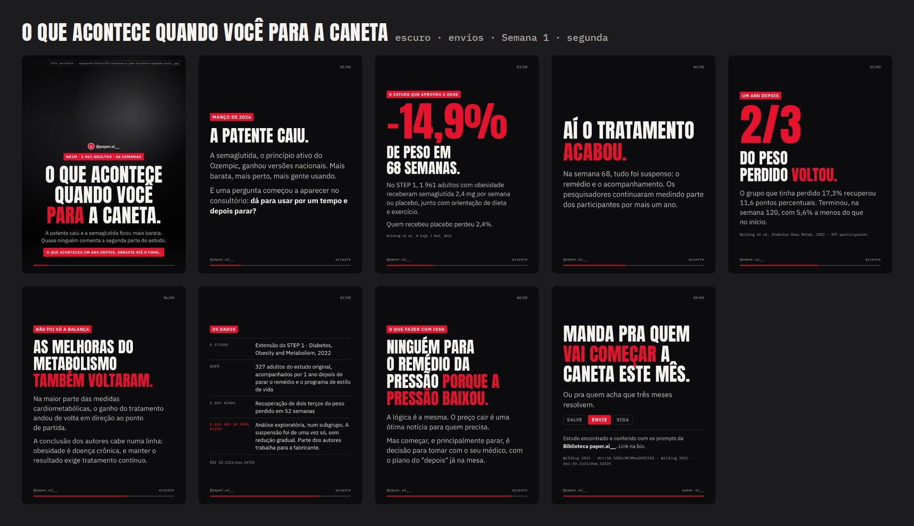

## Sentar no chão e levantar sem as mãos

**vibrante** · Estudo brasileiro sobre o teste de sentar e levantar, publicado em set/2026 · Semana 1 · terça · 9 slides · [slides](02-sentar-e-levantar/) · [legenda](02-sentar-e-levantar/legenda.txt) · [alt text](02-sentar-e-levantar/alt-text.txt)

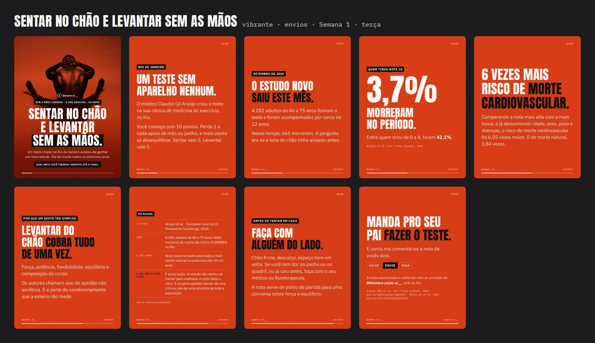

## O cafezinho não é o vilão

**claro** · Café no dia a dia do brasileiro (maior produtor do mundo) · Semana 1 · quarta · 9 slides · [slides](03-cafe/) · [legenda](03-cafe/legenda.txt) · [alt text](03-cafe/alt-text.txt)

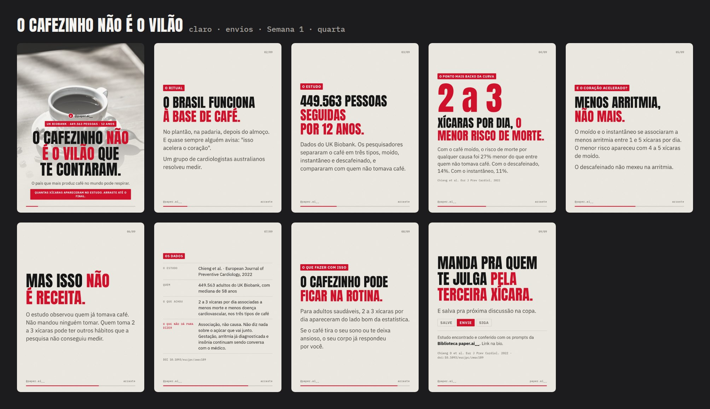

## Solidão e 100 mortes por hora

**escuro** · Relatório da OMS sobre conexão social (871 mil mortes por ano) · Semana 1 · quinta · 9 slides · [slides](04-solidao/) · [legenda](04-solidao/legenda.txt) · [alt text](04-solidao/alt-text.txt)

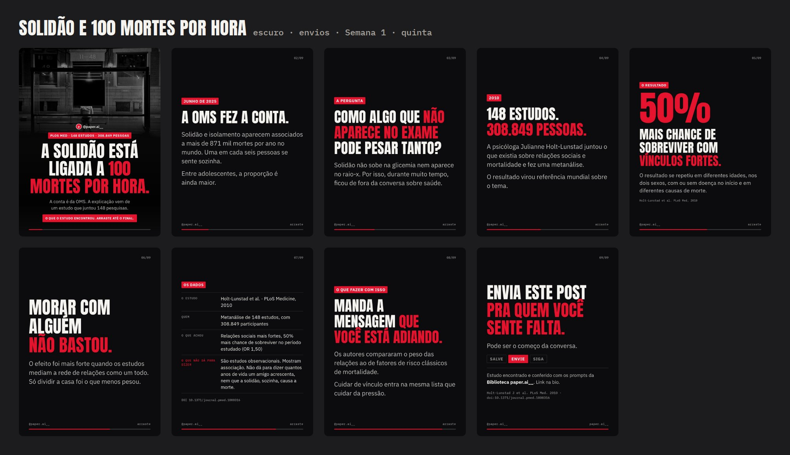

## Proibir o celular na escola não bastou

**vibrante** · Lei 15.100 (celular nas escolas) completou um ano; MEC mede o impacto · Semana 1 · sexta · 9 slides · [slides](05-celular-na-escola/) · [legenda](05-celular-na-escola/legenda.txt) · [alt text](05-celular-na-escola/alt-text.txt)

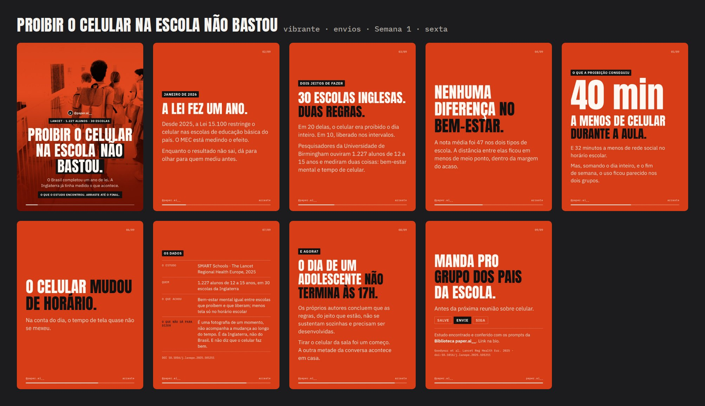

## A meta de 10 mil passos era nome de produto

**claro** · A meta de passos do relógio e do celular (e de onde veio o número 10 mil) · Semana 2 · segunda · 9 slides · [slides](06-dez-mil-passos/) · [legenda](06-dez-mil-passos/legenda.txt) · [alt text](06-dez-mil-passos/alt-text.txt)

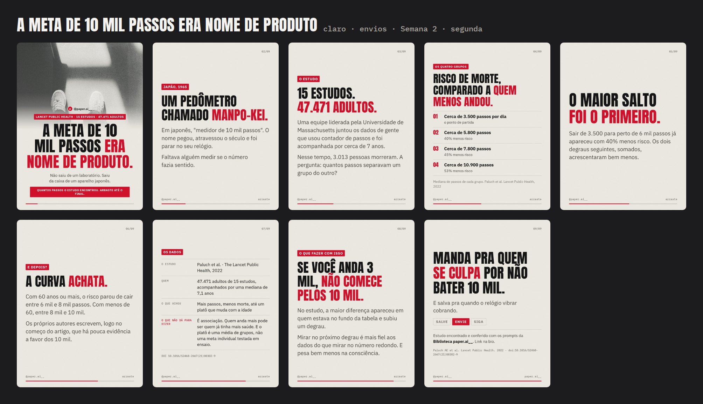

## O quase ganhar é o que prende

**escuro** · Bets custam R$ 30,6 bi por ano ao SUS; 574 mil pessoas já pediram autoexclusão · Semana 2 · terça · 10 slides · [slides](07-bets/) · [legenda](07-bets/legenda.txt) · [alt text](07-bets/alt-text.txt)

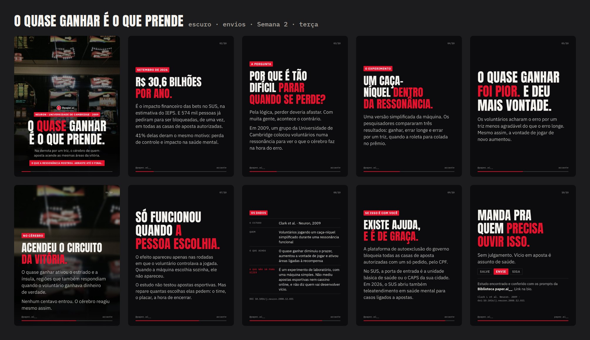

## Deram IA para os médicos. A IA sozinha foi melhor.

**vibrante** · Médicos usando IA no dia a dia do consultório e do plantão · Semana 2 · quarta · 10 slides · [slides](08-ia-vs-medicos/) · [legenda](08-ia-vs-medicos/legenda.txt) · [alt text](08-ia-vs-medicos/alt-text.txt)

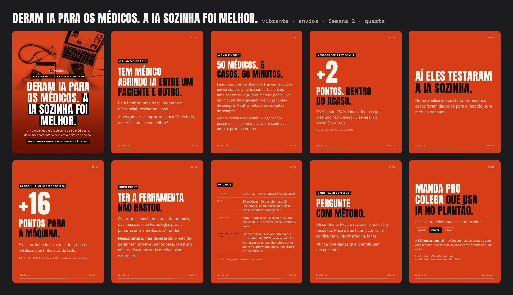

## Seus genes explicam menos do que você pensa

**claro** · "Na minha família todo mundo tem": genética, longevidade e o expossoma · Semana 2 · quinta · 9 slides · [slides](09-genes-vs-estilo-de-vida/) · [legenda](09-genes-vs-estilo-de-vida/legenda.txt) · [alt text](09-genes-vs-estilo-de-vida/alt-text.txt)

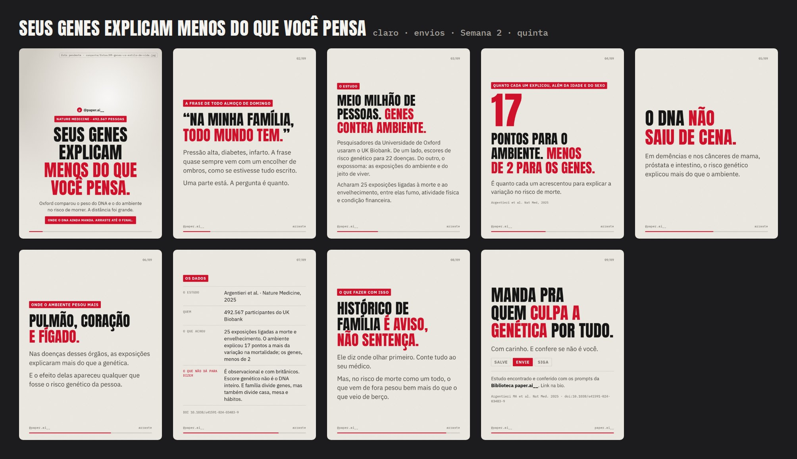

## A dose de álcool que menos faz mal é zero

**escuro** · Uma taça de vinho por dia faz bem ao coração? · Semana 2 · sexta · 10 slides · [slides](10-alcool/) · [legenda](10-alcool/legenda.txt) · [alt text](10-alcool/alt-text.txt)

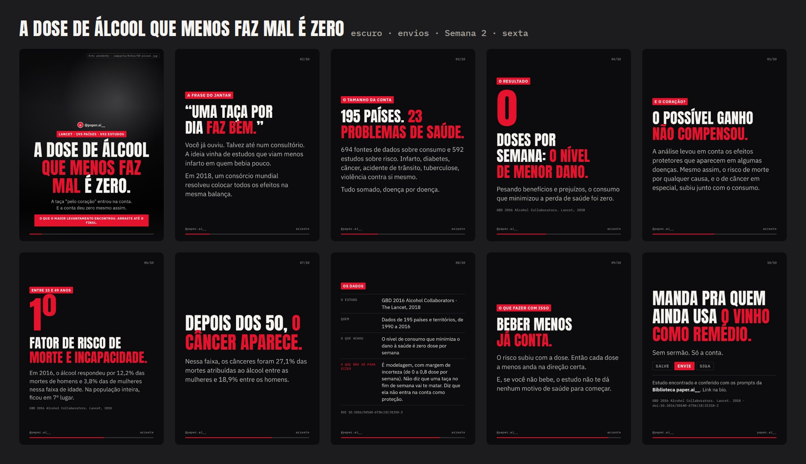

## A palavra ultraprocessado nasceu no Brasil

**vibrante** · Ultraprocessados no centro do debate sobre alimentação (rótulos, Guia Alimentar, classificação NOVA) · Semana 3 · segunda · 9 slides · [slides](11-ultraprocessados/) · [legenda](11-ultraprocessados/legenda.txt) · [alt text](11-ultraprocessados/alt-text.txt)

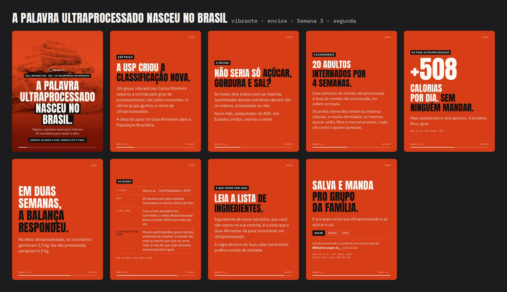

## A fita na boca que viralizou

**claro** · Trend de dormir com fita na boca (mouth taping) · Semana 3 · terça · 9 slides · [slides](12-fita-na-boca/) · [legenda](12-fita-na-boca/legenda.txt) · [alt text](12-fita-na-boca/alt-text.txt)

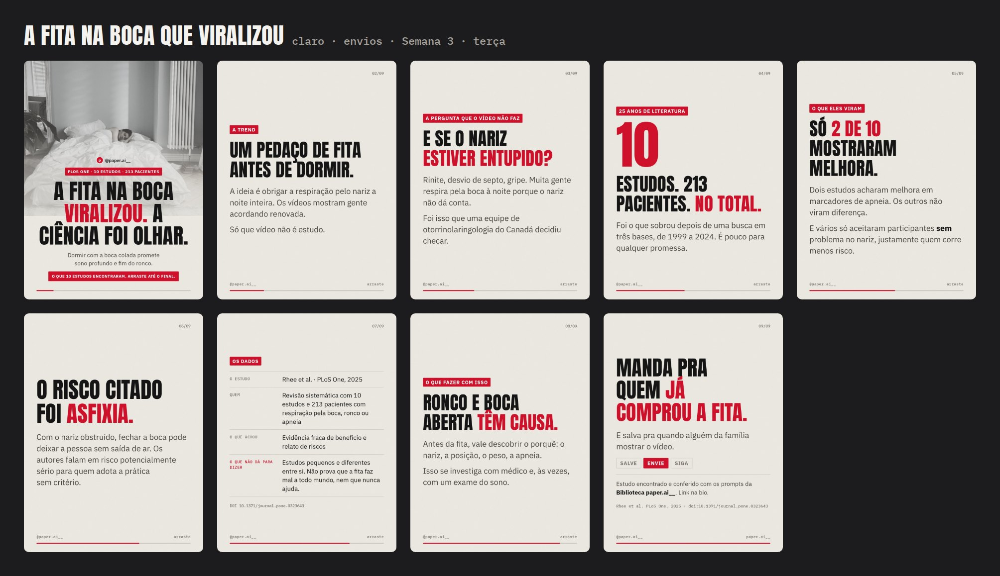

## 3 da manhã, você desabafou com um chatbot

**escuro** · Gente usando IA como terapeuta, principalmente de madrugada · Semana 3 · quarta · 10 slides · [slides](13-chatgpt-terapeuta/) · [legenda](13-chatgpt-terapeuta/legenda.txt) · [alt text](13-chatgpt-terapeuta/alt-text.txt)

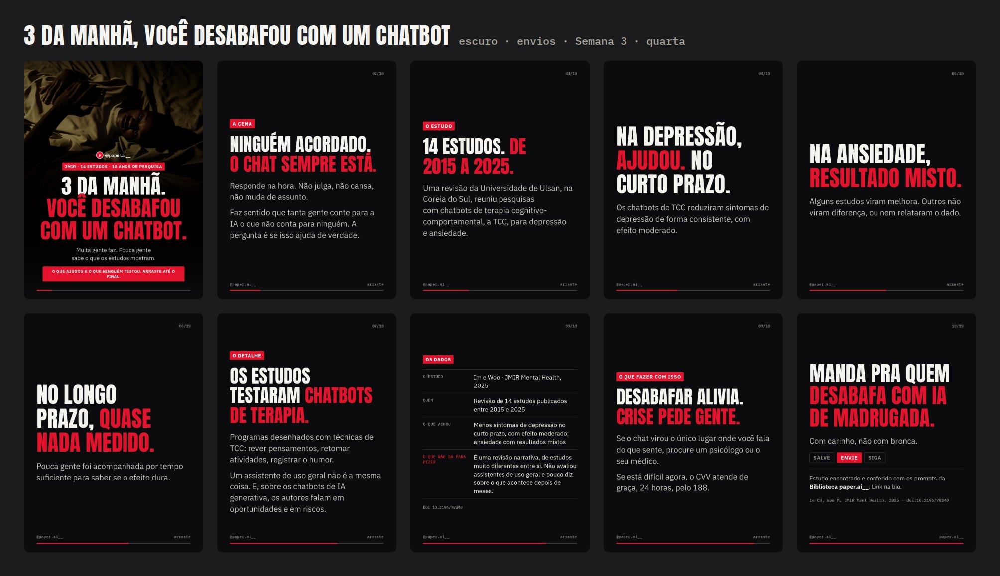

## 70 mil inscritos no Rio. 5 minutos já contavam.

**vibrante** · O boom da corrida de rua (Maratona do Rio 2026 com recorde de cerca de 70 mil inscritos) · Semana 3 · quinta · 10 slides · [slides](14-corrida/) · [legenda](14-corrida/legenda.txt) · [alt text](14-corrida/alt-text.txt)

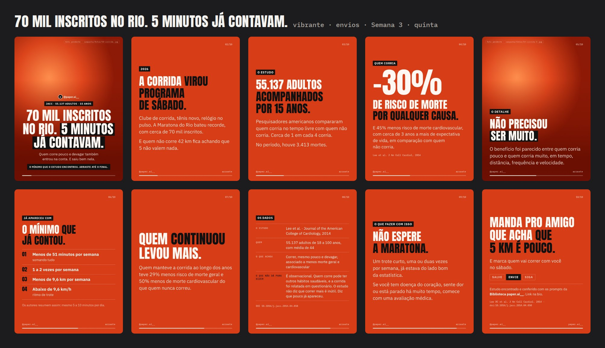

## O jejum intermitente empatou com o básico

**claro** · Jejum intermitente e "janela de alimentação" como estratégia para emagrecer · Semana 3 · sexta · 9 slides · [slides](15-jejum-intermitente/) · [legenda](15-jejum-intermitente/legenda.txt) · [alt text](15-jejum-intermitente/alt-text.txt)

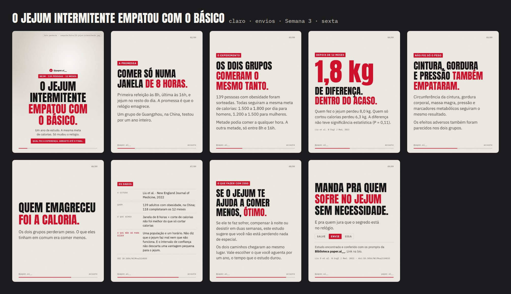

## Tem plástico no cérebro humano

**escuro** · Microplásticos no corpo humano (manchetes que viralizaram) · Semana 4 · segunda · 10 slides · [slides](16-microplastico/) · [legenda](16-microplastico/legenda.txt) · [alt text](16-microplastico/alt-text.txt)

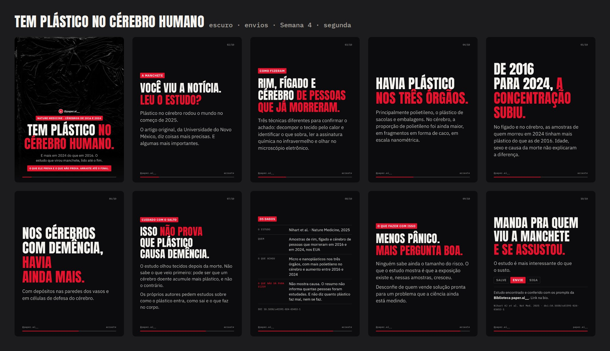

## O calor assusta. O frio matou mais.

**vibrante** · Ondas de calor e recordes de temperatura · Semana 4 · terça · 9 slides · [slides](17-calor-e-frio/) · [legenda](17-calor-e-frio/legenda.txt) · [alt text](17-calor-e-frio/alt-text.txt)

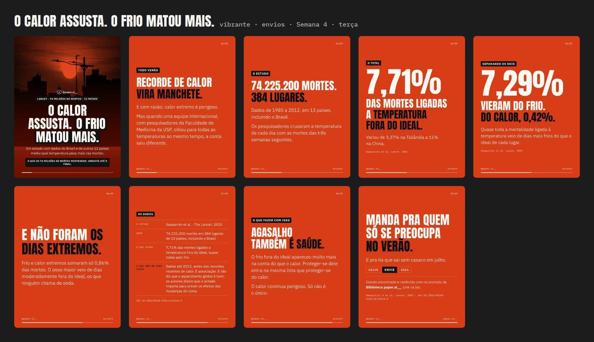

## O multivitamínico não te fez viver mais

**claro** · Febre de suplementos e "rotinas de vitaminas" nas redes · Semana 4 · quarta · 9 slides · [slides](18-multivitaminico/) · [legenda](18-multivitaminico/legenda.txt) · [alt text](18-multivitaminico/alt-text.txt)

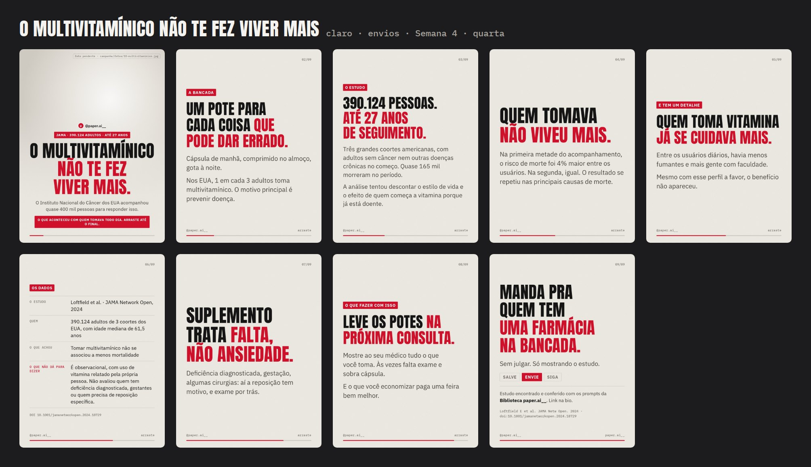

## Seu aperto de mão prevê mais que a sua pressão

**escuro** · Força muscular e longevidade (a onda do treino de força) · Semana 4 · quinta · 9 slides · [slides](19-aperto-de-mao/) · [legenda](19-aperto-de-mao/legenda.txt) · [alt text](19-aperto-de-mao/alt-text.txt)

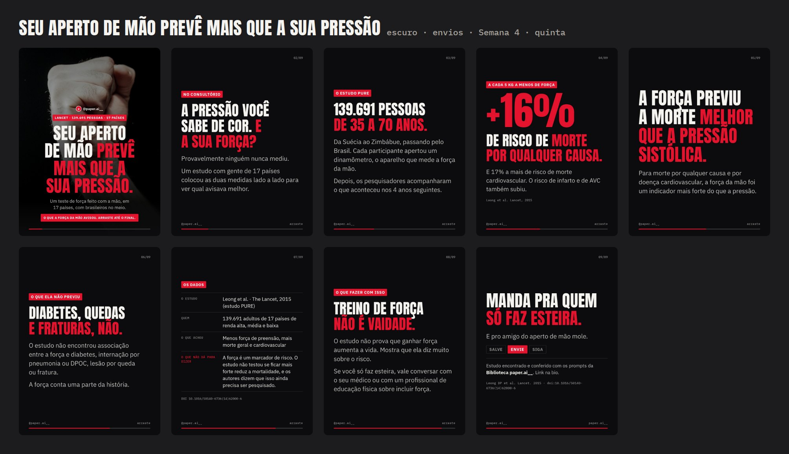

## 1 minuto, 3 vezes ao dia, sem academia

**vibrante** · "Não tenho tempo pra academia" e a moda dos treinos curtos · Semana 4 · sexta · 10 slides · [slides](20-um-minuto/) · [legenda](20-um-minuto/legenda.txt) · [alt text](20-um-minuto/alt-text.txt)

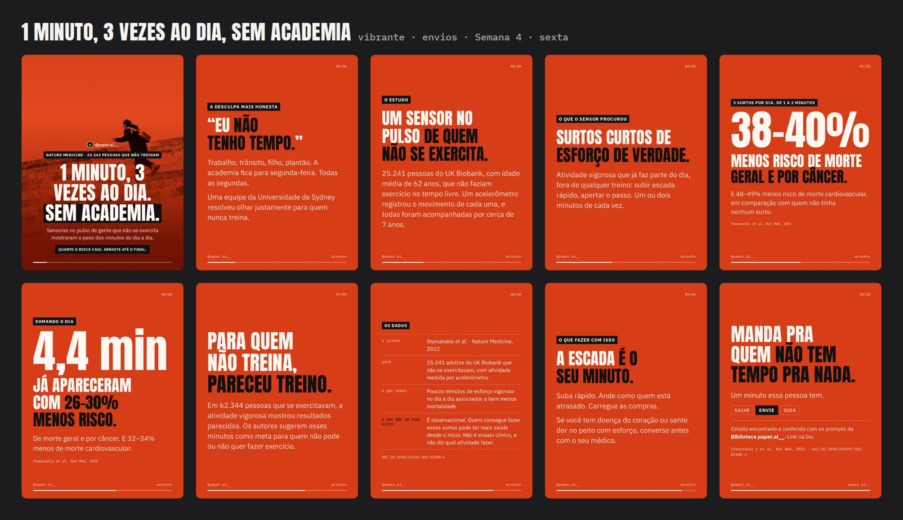
