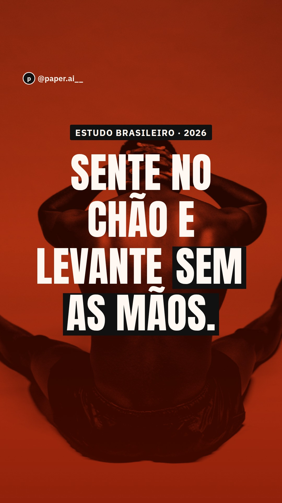
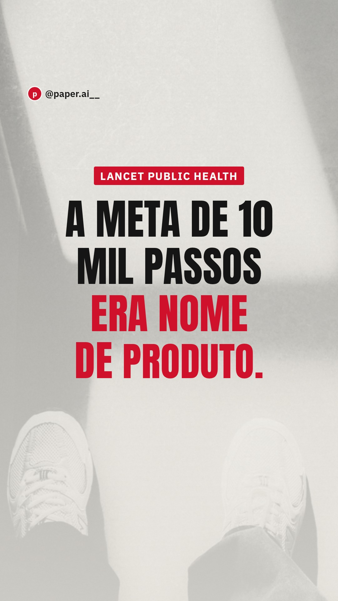
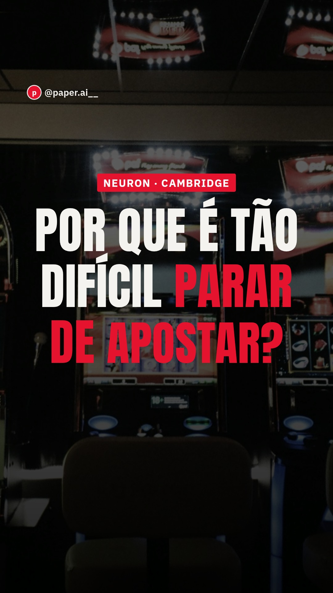
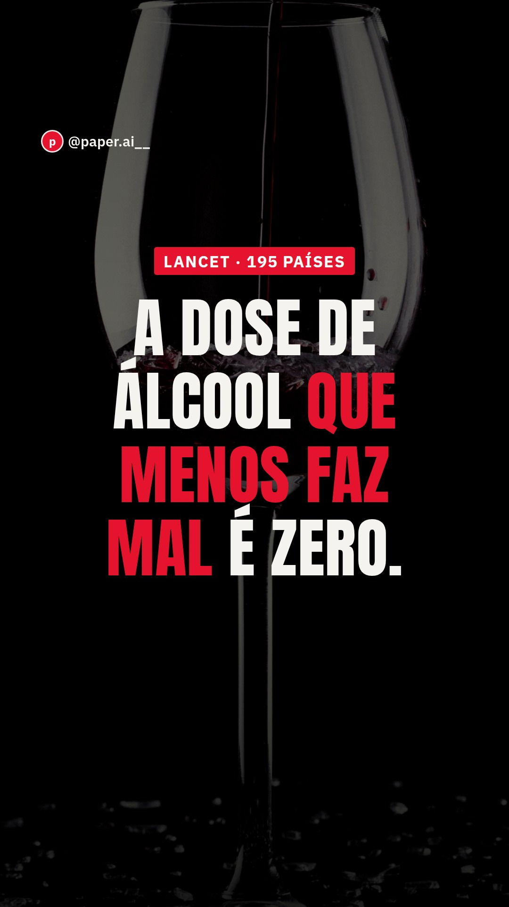
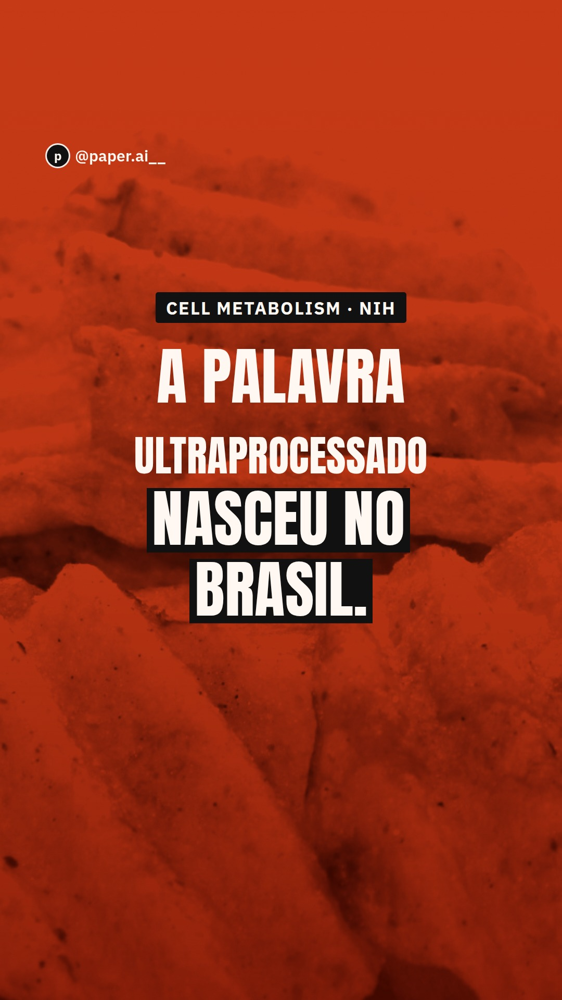
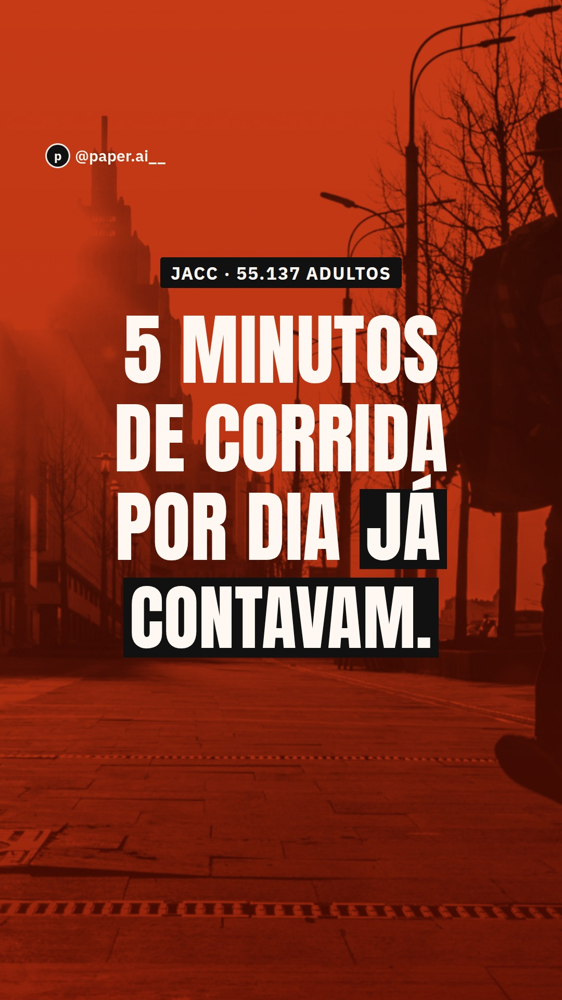
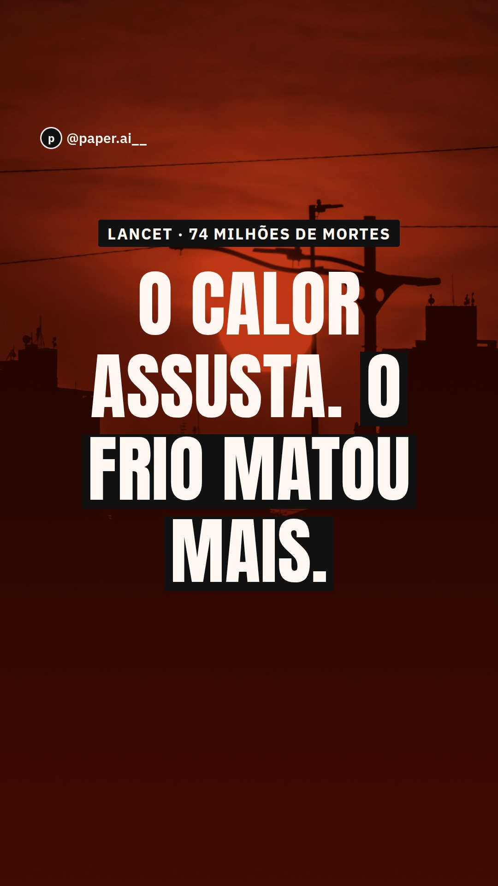
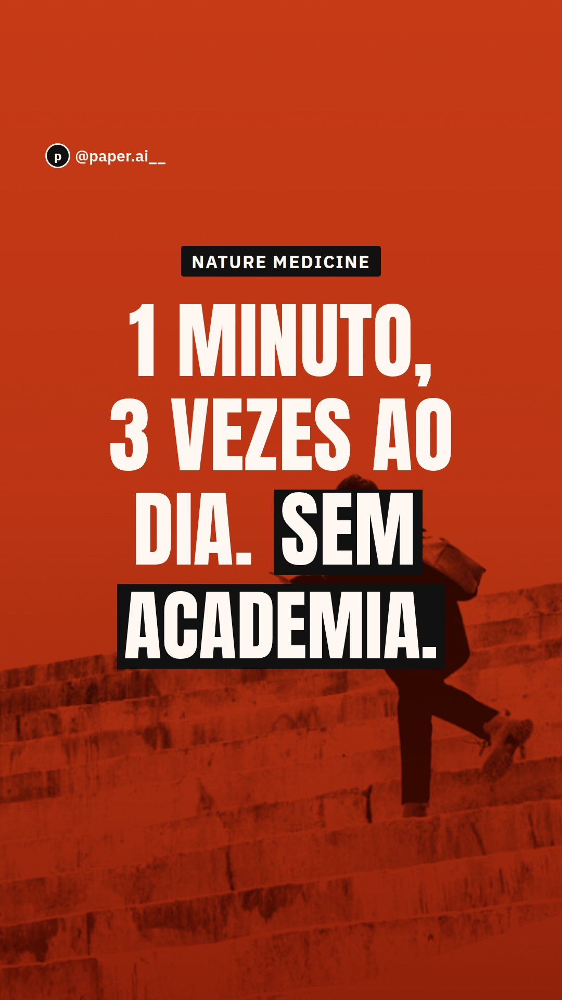

# Reels

Gerado por `npm run reels`. Vídeo vertical 9:16 (1080×1920), 30 fps, H.264, com faixa de áudio em silêncio.

Cada pasta tem o vídeo (`reel.mp4`), a capa (`capa.jpg`), a legenda pronta para colar (`legenda.txt`) e o texto que aparece na tela (`roteiro.txt`).

**Antes de publicar, escolha um áudio em alta no próprio Instagram** (instrumental, volume baixo). O vídeo sai sem música de propósito: música com direitos só pode entrar pela biblioteca do app.

| Reel | Duração | Carrossel do mesmo tema | Estudo | Quando postar |
|---|---|---|---|---|
| [O que acontece quando você para a caneta](#01-canetas) | 29.8 s | [01-canetas-o-que-acontece-quando-para](../campanha/01-canetas-o-que-acontece-quando-para/) | STEP 1 e extensão (NEJM 2021; Diabetes Obes Metab 2022) | Semana 1 · domingo |
| [O teste de sentar e levantar do chão](#02-sentar-e-levantar) | 28 s | [02-sentar-e-levantar](../campanha/02-sentar-e-levantar/) | Araújo et al. (Eur J Prev Cardiol, 2026) | Semana 1 · sábado |
| [A meta de 10 mil passos](#06-dez-mil-passos) | 29.1 s | [06-dez-mil-passos](../campanha/06-dez-mil-passos/) | Paluch et al. (Lancet Public Health, 2022) | Semana 3 · quarta |
| [Por que é tão difícil parar de apostar](#07-bets) | 30.4 s | [07-bets](../campanha/07-bets/) | Clark et al. (Neuron, 2009) | Semana 2 · domingo |
| [Deram IA para os médicos](#08-ia-vs-medicos) | 29.4 s | [08-ia-vs-medicos](../campanha/08-ia-vs-medicos/) | Goh et al. (JAMA Network Open, 2024) | Semana 2 · sábado |
| [A dose de álcool que menos faz mal](#10-alcool) | 25.2 s | [10-alcool](../campanha/10-alcool/) | GBD 2016 Alcohol Collaborators (The Lancet, 2018) | Semana 4 · quarta |
| [A palavra ultraprocessado nasceu no Brasil](#11-ultraprocessados) | 28.6 s | [11-ultraprocessados](../campanha/11-ultraprocessados/) | Hall et al. (Cell Metabolism, 2019) | Semana 3 · sábado |
| [5 minutos de corrida já contavam](#14-corrida) | 25.4 s | [14-corrida](../campanha/14-corrida/) | Lee et al. (J Am Coll Cardiol, 2014) | Semana 3 · domingo |
| [O calor assusta, o frio matou mais](#17-calor-e-frio) | 25.9 s | [17-calor-e-frio](../campanha/17-calor-e-frio/) | Gasparrini et al. (The Lancet, 2015) | Semana 4 · sábado |
| [1 minuto, 3 vezes ao dia](#20-um-minuto) | 25.3 s | [20-um-minuto](../campanha/20-um-minuto/) | Stamatakis et al. (Nature Medicine, 2022) | Semana 4 · domingo |

## O que acontece quando você para a caneta

**escuro** · 29.8 s · 7 cenas · Semana 1 · domingo · [vídeo](01-canetas/reel.mp4) · [legenda](01-canetas/legenda.txt) · [texto na tela](01-canetas/roteiro.txt)

## O teste de sentar e levantar do chão

**vibrante** · 28 s · 7 cenas · Semana 1 · sábado · [vídeo](02-sentar-e-levantar/reel.mp4) · [legenda](02-sentar-e-levantar/legenda.txt) · [texto na tela](02-sentar-e-levantar/roteiro.txt)

## A meta de 10 mil passos

**claro** · 29.1 s · 7 cenas · Semana 3 · quarta · [vídeo](06-dez-mil-passos/reel.mp4) · [legenda](06-dez-mil-passos/legenda.txt) · [texto na tela](06-dez-mil-passos/roteiro.txt)

## Por que é tão difícil parar de apostar

**escuro** · 30.4 s · 7 cenas · Semana 2 · domingo · [vídeo](07-bets/reel.mp4) · [legenda](07-bets/legenda.txt) · [texto na tela](07-bets/roteiro.txt)

## Deram IA para os médicos

**vibrante** · 29.4 s · 7 cenas · Semana 2 · sábado · [vídeo](08-ia-vs-medicos/reel.mp4) · [legenda](08-ia-vs-medicos/legenda.txt) · [texto na tela](08-ia-vs-medicos/roteiro.txt)

## A dose de álcool que menos faz mal

**escuro** · 25.2 s · 6 cenas · Semana 4 · quarta · [vídeo](10-alcool/reel.mp4) · [legenda](10-alcool/legenda.txt) · [texto na tela](10-alcool/roteiro.txt)

## A palavra ultraprocessado nasceu no Brasil

**vibrante** · 28.6 s · 7 cenas · Semana 3 · sábado · [vídeo](11-ultraprocessados/reel.mp4) · [legenda](11-ultraprocessados/legenda.txt) · [texto na tela](11-ultraprocessados/roteiro.txt)

## 5 minutos de corrida já contavam

**vibrante** · 25.4 s · 6 cenas · Semana 3 · domingo · [vídeo](14-corrida/reel.mp4) · [legenda](14-corrida/legenda.txt) · [texto na tela](14-corrida/roteiro.txt)

## O calor assusta, o frio matou mais

**vibrante** · 25.9 s · 7 cenas · Semana 4 · sábado · [vídeo](17-calor-e-frio/reel.mp4) · [legenda](17-calor-e-frio/legenda.txt) · [texto na tela](17-calor-e-frio/roteiro.txt)

## 1 minuto, 3 vezes ao dia

**vibrante** · 25.3 s · 6 cenas · Semana 4 · domingo · [vídeo](20-um-minuto/reel.mp4) · [legenda](20-um-minuto/legenda.txt) · [texto na tela](20-um-minuto/roteiro.txt)

