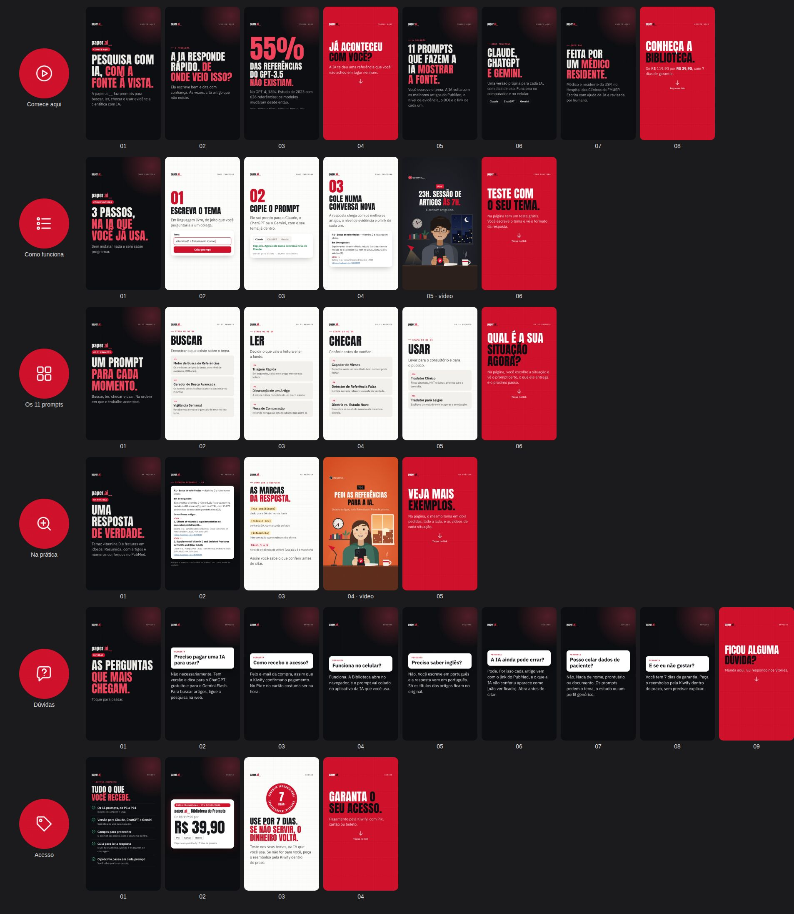

# Stories dos destaques

Gerado por `npm run stories` a partir de [`stories/destaques.yaml`](../../stories/destaques.yaml). Cada pasta é um destaque: os Stories na ordem (`01.jpg`, `02.jpg`…), um vídeo quando houver, e a capa do destaque (`capa.png`).

## Como montar os destaques

1. Poste os Stories de um destaque, **na ordem dos números**, no mesmo dia (um a cada poucos minutos, ou todos de uma vez).
2. Nos Stories com seta, coloque o sticker indicado (link, enquete ou caixa de perguntas) no espaço livre da seta. A seta fica embaixo do sticker.
3. Depois de postar, abra cada Story e toque em **Destaque**, escolhendo o destaque certo (crie com o nome da tabela). Stories somem em 24 horas; nos destaques ficam.
4. Em **Editar destaque → Editar capa**, use a `capa.png` da pasta.
5. Ordene os destaques no perfil nesta ordem: **Comece aqui, Como funciona, Os 11 prompts, Na prática, Dúvidas, Acesso**. O primeiro é o que mais gente abre.

Boas práticas que os Stories já seguem: uma ideia por Story, texto grande dentro da área segura (longe da barra de cima e do campo de resposta embaixo), gancho no primeiro Story de cada destaque, prova com número e fonte, e um pedido claro no fim com link. As respostas da caixa de perguntas viram Stories novos, que podem entrar no destaque Dúvidas.

Links: a página de vendas é `https://bibliotecapaperai.netlify.app` e o checkout é `https://pay.kiwify.com.br/Kxd6DTl`. Todos os links levam `utm_source=instagram&utm_medium=stories` e o nome do destaque em `utm_content`, para você ver na Kiwify quantas vendas vieram de cada um. Se a página estiver em outro endereço, troque `pagina` no YAML e rode `npm run stories` de novo. Enquanto a página não estiver na Netlify, dá para usar o link público da prévia (https://claude.ai/artifact/Ba9iDP11JHwLTNgsKbfctN), sem os `utm`.

## 1. Comece aqui

Pasta [`01-comece-aqui/`](01-comece-aqui/) · capa `01-comece-aqui/capa.png`

| Story | Arquivo | O que diz | O que colocar no app |
|---|---|---|---|
| 1 | [`01.jpg`](01-comece-aqui/01.jpg) | Pesquisa com IA, com a fonte à vista. |  |
| 2 | [`02.jpg`](01-comece-aqui/02.jpg) | A IA responde rápido. De onde veio isso? |  |
| 3 | [`03.jpg`](01-comece-aqui/03.jpg) | 55% das referências do GPT-3.5 não existiam. |  |
| 4 | [`04.jpg`](01-comece-aqui/04.jpg) | Já aconteceu com você? | **Enquete: Já aconteceu / Ainda não** no espaço da seta |
| 5 | [`05.jpg`](01-comece-aqui/05.jpg) | 11 prompts que fazem a IA mostrar a fonte. |  |
| 6 | [`06.jpg`](01-comece-aqui/06.jpg) | Claude, ChatGPT e Gemini. |  |
| 7 | [`07.jpg`](01-comece-aqui/07.jpg) | Feita por um médico residente. |  |
| 8 | [`08.jpg`](01-comece-aqui/08.jpg) | Conheça a Biblioteca. | **Sticker de link** no espaço da seta: `https://bibliotecapaperai.netlify.app/?utm_source=instagram&utm_medium=stories&utm_content=comece-aqui` |

## 2. Como funciona

Pasta [`02-como-funciona/`](02-como-funciona/) · capa `02-como-funciona/capa.png`

| Story | Arquivo | O que diz | O que colocar no app |
|---|---|---|---|
| 1 | [`01.jpg`](02-como-funciona/01.jpg) | 3 passos, na IA que você já usa. |  |
| 2 | [`02.jpg`](02-como-funciona/02.jpg) | Escreva o tema |  |
| 3 | [`03.jpg`](02-como-funciona/03.jpg) | Copie o prompt |  |
| 4 | [`04.jpg`](02-como-funciona/04.jpg) | Cole numa conversa nova |  |
| 5 | [`05.mp4`](02-como-funciona/05.mp4) | Os 3 passos em 28 segundos | Vídeo: poste o MP4 como está |
| 6 | [`06.jpg`](02-como-funciona/06.jpg) | Teste com o seu tema. | **Sticker de link** no espaço da seta: `https://bibliotecapaperai.netlify.app/?utm_source=instagram&utm_medium=stories&utm_content=como-funciona#teste` |

## 3. Os 11 prompts

Pasta [`03-os-prompts/`](03-os-prompts/) · capa `03-os-prompts/capa.png`

| Story | Arquivo | O que diz | O que colocar no app |
|---|---|---|---|
| 1 | [`01.jpg`](03-os-prompts/01.jpg) | Um prompt para cada momento. |  |
| 2 | [`02.jpg`](03-os-prompts/02.jpg) | Etapa Buscar |  |
| 3 | [`03.jpg`](03-os-prompts/03.jpg) | Etapa Ler |  |
| 4 | [`04.jpg`](03-os-prompts/04.jpg) | Etapa Checar |  |
| 5 | [`05.jpg`](03-os-prompts/05.jpg) | Etapa Usar |  |
| 6 | [`06.jpg`](03-os-prompts/06.jpg) | Qual é a sua situação agora? | **Sticker de link** no espaço da seta: `https://bibliotecapaperai.netlify.app/?utm_source=instagram&utm_medium=stories&utm_content=os-prompts#prompts` |

## 4. Na prática

Pasta [`04-na-pratica/`](04-na-pratica/) · capa `04-na-pratica/capa.png`

| Story | Arquivo | O que diz | O que colocar no app |
|---|---|---|---|
| 1 | [`01.jpg`](04-na-pratica/01.jpg) | Uma resposta de verdade. |  |
| 2 | [`02.jpg`](04-na-pratica/02.jpg) | Exemplo de resposta do P1 |  |
| 3 | [`03.jpg`](04-na-pratica/03.jpg) | As marcas da resposta |  |
| 4 | [`04.mp4`](04-na-pratica/04.mp4) | O P8 conferindo as referências de um TCC | Vídeo: poste o MP4 como está |
| 5 | [`05.jpg`](04-na-pratica/05.jpg) | Veja mais exemplos. | **Sticker de link** no espaço da seta: `https://bibliotecapaperai.netlify.app/?utm_source=instagram&utm_medium=stories&utm_content=na-pratica#diferenca` |

## 5. Dúvidas

Pasta [`05-duvidas/`](05-duvidas/) · capa `05-duvidas/capa.png`

| Story | Arquivo | O que diz | O que colocar no app |
|---|---|---|---|
| 1 | [`01.jpg`](05-duvidas/01.jpg) | As perguntas que mais chegam. |  |
| 2 | [`02.jpg`](05-duvidas/02.jpg) | Preciso pagar uma IA para usar? |  |
| 3 | [`03.jpg`](05-duvidas/03.jpg) | Como recebo o acesso? |  |
| 4 | [`04.jpg`](05-duvidas/04.jpg) | Funciona no celular? |  |
| 5 | [`05.jpg`](05-duvidas/05.jpg) | Preciso saber inglês? |  |
| 6 | [`06.jpg`](05-duvidas/06.jpg) | A IA ainda pode errar? |  |
| 7 | [`07.jpg`](05-duvidas/07.jpg) | Posso colar dados de paciente? |  |
| 8 | [`08.jpg`](05-duvidas/08.jpg) | E se eu não gostar? |  |
| 9 | [`09.jpg`](05-duvidas/09.jpg) | Ficou alguma dúvida? | **Caixa de perguntas: Qual é a sua dúvida sobre a Biblioteca?** no espaço da seta |

## 6. Acesso

Pasta [`06-acesso/`](06-acesso/) · capa `06-acesso/capa.png`

| Story | Arquivo | O que diz | O que colocar no app |
|---|---|---|---|
| 1 | [`01.jpg`](06-acesso/01.jpg) | O que você recebe |  |
| 2 | [`02.jpg`](06-acesso/02.jpg) | Preço |  |
| 3 | [`03.jpg`](06-acesso/03.jpg) | Garantia de 7 dias |  |
| 4 | [`04.jpg`](06-acesso/04.jpg) | Garanta o seu acesso. | **Sticker de link** no espaço da seta: `https://pay.kiwify.com.br/Kxd6DTl?utm_source=instagram&utm_medium=stories&utm_content=acesso` |
